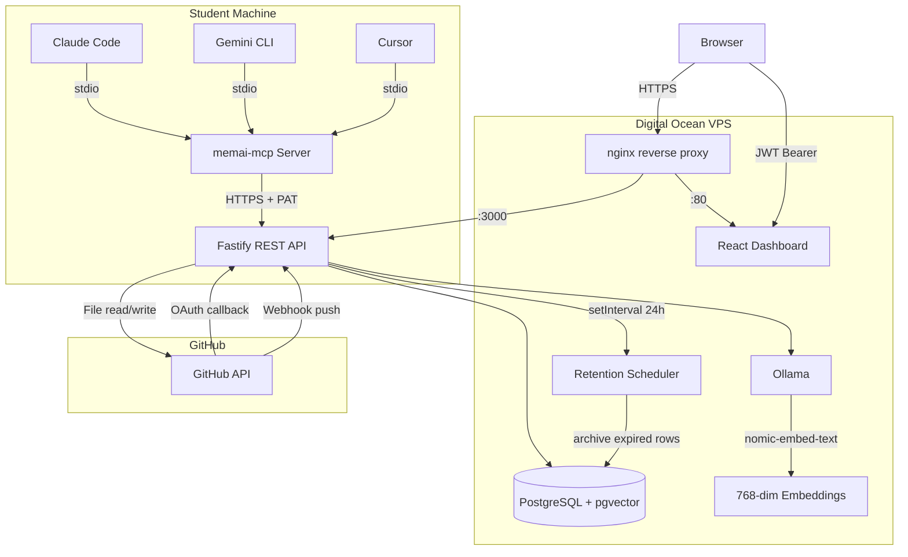
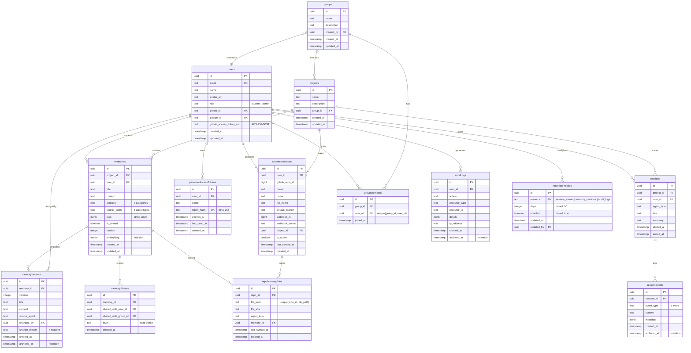

# System Design & Architecture

## Architecture Overview

MemAI follows a standard client-server architecture deployed on a single VPS. AI agent CLIs communicate via an MCP server (running locally on the student's machine) that calls the central REST API over HTTPS.

> **Note**: In development, the API runs on `:3000` (Fastify directly) and the dashboard on `:5173` (Vite dev server). In production, nginx serves the dashboard on `:80`/`:443` and proxies API requests to `:3000`.

### Technology Stack

| Layer | Technology | Rationale |
|---|---|---|
| API Framework | Fastify 5 | High performance, native TypeScript, plugin ecosystem |
| ORM | Drizzle ORM 0.38 | Type-safe, SQL-like query builder, excellent migration tooling |
| Database | PostgreSQL 16 + pgvector | Relational + vector search in one DB, no separate vector service |
| Embeddings | Ollama (nomic-embed-text) | Local inference, no API costs, 768-dim vectors |
| Frontend | React 19 + Vite 6 + Tailwind 4 | Modern stack, fast dev builds, utility-first CSS |
| MCP Server | @modelcontextprotocol/sdk | Standard protocol for AI agent tool integration |
| Auth | GitHub/Google OAuth + JWT + PAT | OAuth for dashboard login; PAT for headless MCP auth |
| Monorepo | pnpm 9 + Turborepo | Fast installs, parallel builds, workspace dependency management |
| CI/CD | GitHub Actions + GHCR | Build → push images → SSH deploy to VPS |
| Containerization | Docker Compose | Simple multi-service orchestration on single VPS |

## Data Models

The database has 13 tables organized around users, groups, projects, and memories.

### Enumerations

| Enum | Values |
|---|---|
| Roles | `student`, `admin` |
| Memory Categories | `architecture`, `convention`, `decision`, `preference`, `snippet`, `context`, `other` |
| Agent Types | `claude-code`, `gemini-cli`, `cursor`, `kilo-code`, `opencode`, `generic` |
| Session Event Types | `message`, `tool_call`, `file_edit`, `decision`, `error` |
| Change Reasons | `manual_edit`, `mcp_write`, `repo_sync`, `admin_edit` |
| Export Formats | `claude-md`, `gemini-md`, `cursorrules`, `skill-md`, `json`, `report` |
| Share Levels | `read`, `write` |

## API Design

### Base URL
`/api/v1`

### Authentication
- **Dashboard**: GitHub/Google OAuth -> JWT (7-day expiry, `Authorization: Bearer <jwt>`)
- **MCP Server**: Personal Access Token (`Authorization: Bearer memai_<64hex>`)
- Both resolved in `authMiddleware` — JWT tried first, then PAT hash lookup

### Endpoint Inventory (56 endpoints)

#### Health
| Method | Path | Auth | Description |
|---|---|---|---|
| GET | `/health` | None | DB + Ollama connectivity check |

#### Auth (9 endpoints)
| Method | Path | Auth | Description |
|---|---|---|---|
| GET | `/auth/github` | None | Initiate GitHub OAuth |
| GET | `/auth/github/callback` | None | GitHub OAuth callback, returns JWT |
| GET | `/auth/google` | None | Initiate Google OAuth |
| GET | `/auth/google/callback` | None | Google OAuth callback, returns JWT |
| GET | `/auth/me` | JWT/PAT | Get current user |
| POST | `/auth/tokens` | JWT/PAT | Create PAT |
| GET | `/auth/tokens` | JWT/PAT | List user's PATs |
| DELETE | `/auth/tokens/:id` | JWT/PAT | Delete a PAT |
| GET | `/auth/validate` | JWT/PAT | Validate token, return user |

#### Users (3 endpoints)
| Method | Path | Auth | Description |
|---|---|---|---|
| GET | `/users` | Admin | List all users |
| GET | `/users/:id` | JWT/PAT | Get user (students: self only) |
| PATCH | `/users/:id` | JWT/PAT | Update user (role change: admin only) |

#### Groups (6 endpoints)
| Method | Path | Auth | Description |
|---|---|---|---|
| GET | `/groups` | JWT/PAT | List groups (admins: all; students: own) |
| POST | `/groups` | JWT/PAT | Create group |
| PATCH | `/groups/:id` | JWT/PAT | Update group |
| DELETE | `/groups/:id` | JWT/PAT | Delete group |
| POST | `/groups/:id/members` | JWT/PAT | Add member |
| DELETE | `/groups/:id/members/:userId` | JWT/PAT | Remove member |

#### Projects (5 endpoints)
| Method | Path | Auth | Description |
|---|---|---|---|
| GET | `/projects` | JWT/PAT | List projects with groups |
| GET | `/projects/:id` | JWT/PAT | Get project detail (memories + sessions) |
| POST | `/projects` | JWT/PAT | Create project |
| PATCH | `/projects/:id` | JWT/PAT | Update project |
| DELETE | `/projects/:id` | JWT/PAT | Delete project |

#### Memories (11 endpoints)
| Method | Path | Auth | Description |
|---|---|---|---|
| GET | `/memories` | JWT/PAT | List memories (filters: projectId, category, limit, offset) |
| GET | `/memories/:id` | JWT/PAT | Get memory by ID |
| POST | `/memories` | JWT/PAT | Create memory |
| PATCH | `/memories/:id` | JWT/PAT | Update memory (creates version) |
| DELETE | `/memories/:id` | JWT/PAT | Delete memory |
| POST | `/memories/search` | JWT/PAT | Search by text (+ optional semantic); filters: category, sourceAgent, limit |
| GET | `/memories/:id/versions` | JWT/PAT | Get version history |
| POST | `/memories/share` | JWT/PAT | Share memory with user/group |
| GET | `/memories/shared` | JWT/PAT | Get memories shared with me |
| GET | `/memories/:id/shares` | JWT/PAT | List shares for a memory |
| DELETE | `/memories/shares/:shareId` | JWT/PAT | Revoke a share |

#### Sessions (6 endpoints)
| Method | Path | Auth | Description |
|---|---|---|---|
| GET | `/sessions` | JWT/PAT | List sessions (filters: projectId, limit, offset) |
| GET | `/sessions/:id` | JWT/PAT | Get session by ID |
| POST | `/sessions` | JWT/PAT | Create session |
| POST | `/sessions/:id/end` | JWT/PAT | End session with summary |
| GET | `/sessions/:id/events` | JWT/PAT | List session events |
| POST | `/sessions/events` | JWT/PAT | Add event to session |

#### Repos (7 endpoints)
| Method | Path | Auth | Description |
|---|---|---|---|
| GET | `/repos/available` | JWT/PAT | List user's GitHub repos |
| GET | `/repos` | JWT/PAT | List connected repos |
| POST | `/repos/connect` | JWT/PAT | Connect repo + create webhook |
| DELETE | `/repos/:id` | JWT/PAT | Disconnect repo + remove webhook |
| GET | `/repos/:id/files` | JWT/PAT | List tracked memory files |
| POST | `/repos/:id/sync` | JWT/PAT | Manual re-sync |
| POST | `/repos/:id/push` | JWT/PAT | Push memory to repo file |

#### Webhooks (1 endpoint)
| Method | Path | Auth | Description |
|---|---|---|---|
| POST | `/webhooks/github` | HMAC-SHA256 | Process GitHub push events |

#### Export (1 endpoint)
| Method | Path | Auth | Description |
|---|---|---|---|
| POST | `/export` | JWT/PAT | Export project memories to agent format |

#### Admin (6 endpoints)
| Method | Path | Auth | Description |
|---|---|---|---|
| GET | `/admin/stats` | Admin | System-wide statistics |
| GET | `/admin/audit` | Admin | Audit log viewer (supports `limit`, `offset`) |
| GET | `/admin/retention` | Admin | List retention policies |
| PATCH | `/admin/retention/:resource` | Admin | Update retention policy (days, enabled) |
| GET | `/admin/retention/stats` | Admin | Active vs archived row counts per table |
| POST | `/admin/retention/run` | Admin | Trigger manual retention cleanup |

## Component Breakdown

### `packages/shared` (`@memai/shared`)
Shared TypeScript package consumed by API and MCP server.
- **`constants.ts`**: Agent types, memory categories, session event types, export formats, file patterns
- **`validation.ts`**: 20+ Zod schemas for request validation (memories, sessions, auth, repos, export, MCP tools)
- **`index.ts`**: Re-exports all constants and schemas

### `packages/api` (`@memai/api`)
Fastify REST API — the core backend.
- **`src/index.ts`**: Server bootstrap (CORS, rate limiting, error handling, route registration, retention scheduler via `setInterval` every 24h)
- **`src/db/schema.ts`**: Drizzle ORM schema (13 tables, relations, custom vector type)
- **`src/db/migrate.ts`**: Migration runner
- **`src/db/seed.ts`**: Seed script (admin user, demo group/project)
- **`src/routes/`**: 11 route files (health, auth, users, groups, projects, memories, sessions, repos, webhooks, export, admin)
- **`src/middleware/`**: auth (JWT + PAT), rbac (role checks), audit (`onResponse` hooks for write operations)
- **`src/auth/`**: JWT sign/verify (HS256, 7-day), PAT generation/hashing (SHA-256, `memai_` prefix)
- **`src/services/`**: memory, session, sharing, github (token encryption, webhook verification, file operations), embedding (Ollama), export (6 formats), repo-sync (scan + webhook handler), retention (archival + cleanup), audit (log insert + query)

### `packages/mcp-server` (`memai-mcp`)
MCP protocol server — npm package installed on student machines.
- **`src/server.ts`**: 9 MCP tools (memory CRUD, session lifecycle, shared read, project context)
- **`src/bin/memai-mcp.ts`**: CLI entry point, resolves `MEMAI_TOKEN` + `MEMAI_PROJECT_ID` on startup
- **`src/api-client.ts`**: HTTP client wrapping the MemAI REST API

### `packages/dashboard` (`@memai/dashboard`)
React SPA for admin/student web access.
- **Pages**: Login, AuthCallback, Dashboard (home), Students, Groups, ProjectDetail, Memories, Sessions, Repos, Settings
- **Stack**: React 19, React Router 7, Vite 6, Tailwind 4, Lucide icons
- **Auth flow**: OAuth redirect -> callback page receives JWT -> stored in context -> sent as Bearer header

## Design Decisions

### Drizzle ORM over Prisma
- **Chosen**: Drizzle ORM for its SQL-like query builder and lightweight runtime
- **Rationale**: Drizzle generates plain SQL, supports custom types (needed for pgvector), and has smaller bundle size. Prisma's query engine binary adds deployment complexity.
- **Trade-off**: Less auto-generated client; more manual query writing

### pgvector over Pinecone/Weaviate
- **Chosen**: pgvector extension in PostgreSQL
- **Rationale**: Vector search co-located with relational data avoids a separate service. Single database simplifies deployment on a constrained VPS. Sufficient for the expected scale (< 100K memories).
- **Trade-off**: Less optimized for very large vector datasets; no managed scaling

### PAT over per-request OAuth for MCP
- **Chosen**: Personal Access Tokens for MCP server authentication
- **Rationale**: MCP servers run as child processes of CLI tools — no browser available for OAuth flow. PAT is generated once via dashboard, set as `MEMAI_TOKEN` env var, and used for all API calls.
- **Trade-off**: Token management burden on user; tokens can leak if env vars are exposed

### AES-256-GCM for GitHub token storage
- **Chosen**: Encrypt GitHub OAuth access tokens at rest using AES-256-GCM
- **Rationale**: GitHub tokens grant repo access; storing them in plaintext would be a critical vulnerability. AES-256-GCM provides authenticated encryption with per-token random IVs.
- **Format**: `${iv_hex}:${authTag_hex}:${ciphertext_hex}`

### Monorepo with pnpm workspaces
- **Chosen**: Single repo with 4 packages
- **Rationale**: Shared types and validation schemas between API and MCP server. Turborepo handles parallel builds and dependency-aware task ordering.

### MCP context resolution at startup
- **Chosen**: Resolve user + project once when MCP server starts (via `MEMAI_TOKEN` + `MEMAI_PROJECT_ID`)
- **Rationale**: Avoids per-tool-call auth overhead. The MCP server is short-lived (tied to a single agent session), so stale context is not a concern.
- **Note**: `MEMAI_PROJECT_ID` is trusted without server-side validation at startup (the token is validated via `/auth/validate`, but the project ID is not checked against the user's accessible projects)

### Soft-delete (archive) for data retention
- **Chosen**: Set `archived_at` timestamp instead of hard-deleting expired rows
- **Rationale**: Preserves data for ad-hoc investigation via direct SQL. Partial indexes on `archived_at IS NULL` maintain query performance for active data.
- **Trade-off**: Archived rows still consume disk. No automated purge path in v1. Admins can run `DELETE ... WHERE archived_at IS NOT NULL` + `VACUUM` manually if disk reclamation is needed.

### Audit logging via onResponse hooks
- **Chosen**: `auditLog()` middleware registered as Fastify `onResponse` hooks on write routes
- **Rationale**: Logging after the response is sent avoids adding latency to the request. Fire-and-forget insert with error logging.
- **Covered actions**: `create`, `update`, `delete` on memories, groups, projects, sessions, repos; `share`/`unshare` on memories; `connect`/`disconnect`/`push` on repos; `update` on users

### Google OAuth users and GitHub features
- **Chosen**: Google OAuth users do not have a `githubAccessTokenEnc` field
- **Rationale**: Google OAuth provides identity only; it does not grant GitHub API access. Google OAuth users cannot use repo features (connect, sync, push) until they also authenticate via GitHub.
- **Trade-off**: Users who only log in with Google have limited functionality

### Wildcard memory file patterns skipped in repo sync
- **Chosen**: Only static file patterns (e.g., `CLAUDE.md`, `.cursorrules`) are scanned during repo sync. Wildcard patterns (e.g., `.kilocode/rules/**/*.md`) are excluded.
- **Rationale**: The current GitHub API integration fetches files by exact path. Wildcard scanning would require listing directory contents recursively, which adds complexity and API rate limit pressure.
- **Trade-off**: Kilo Code rule files are not auto-imported

### Removed files not tracked in webhook handler
- **Chosen**: The webhook push handler only processes `added` and `modified` files; `removed` files are ignored
- **Rationale**: Simplifies the initial implementation. Removing a memory file from a repo does not automatically delete the corresponding memory in MemAI.
- **Trade-off**: Stale `repoMemoryFiles` entries may accumulate for deleted files

## Non-Functional Requirements

### Performance
- API rate limit: **100 requests per minute** (global, via `@fastify/rate-limit`)
- Target memory CRUD latency: **< 200ms** (excluding embedding generation)
- Embedding generation (Ollama): **< 2s** per memory (768-dim nomic-embed-text). Embedding is asynchronous — memory creation succeeds immediately; embedding is generated as an enhancement (Phase 5).
- Dashboard initial load: **< 3s** on broadband

### Security
- **Authentication**: JWT (7-day expiry, HS256) for dashboard; SHA-256 hashed PATs for MCP
- **Authorization**: RBAC with `student` and `admin` roles; admin-only routes enforced via `requireAdmin()` middleware
- **Encryption at rest**: GitHub access tokens encrypted with AES-256-GCM (32-byte key from `ENCRYPTION_KEY`). Format: `${iv_hex}:${authTag_hex}:${ciphertext_hex}`
- **Webhook verification**: GitHub push webhooks must be verified with HMAC-SHA256 using constant-time comparison (`timingSafeEqual`). Requests without valid signatures are rejected.
- **Input validation**: All request bodies validated with Zod schemas at route boundaries
- **Audit logging**: All write operations (create, update, delete) on core resources are logged to `audit_logs` table via `onResponse` hooks with userId, action, resourceType, resourceId, and IP address
- **CORS**: Restricted to dashboard origin via `CORS_ORIGIN` env var
- **PAT security**: Raw PAT returned once on creation, never persisted. Only SHA-256 hash stored.
- **OAuth**: CSRF state parameter generated but not validated in v1 (documented as known limitation)

### Scalability
- Designed for **single VPS deployment** serving 10-50 concurrent users
- PostgreSQL handles both relational and vector queries
- Horizontal scaling not planned; vertical scaling (bigger VPS) is the upgrade path
- Data retention policies manage high-volume table growth via soft-delete archival (see `feature-data-retention.md`)

### Reliability
- Docker healthchecks on Postgres (`pg_isready`) and Ollama (`/api/tags`)
- Docker `restart: always` policy for automatic recovery from crashes
- API depends on healthy Postgres before starting
- Graceful error handling with structured JSON error responses
- Idempotent webhook processing (SHA-based dedup on `repoMemoryFiles` unique constraint)
- Graceful degradation: if Ollama is unavailable, memory operations continue without embedding generation

### Observability
- **Structured logging**: Fastify pino JSON logs with request ID, method, URL, status, and response time
- **Health endpoint**: `GET /api/v1/health` checks DB connectivity (`SELECT 1`) and Ollama availability (`/api/tags`)
- **Audit log**: Queryable via `GET /admin/audit` with pagination
- **Retention stats**: Admin can view active vs archived row counts per managed table via `GET /admin/retention/stats`

### Data Integrity
- Memory version history: every `updateMemory` call inserts a `memoryVersions` record and increments `memory.version`
- Unique constraints: `groupMembers(groupId, userId)`, `repoMemoryFiles(repoId, filePath)`, `retentionPolicies(resource)`
- Partial indexes on `archivedAt IS NULL` for `memoryVersions`, `sessionEvents`, `auditLogs` to maintain query performance
