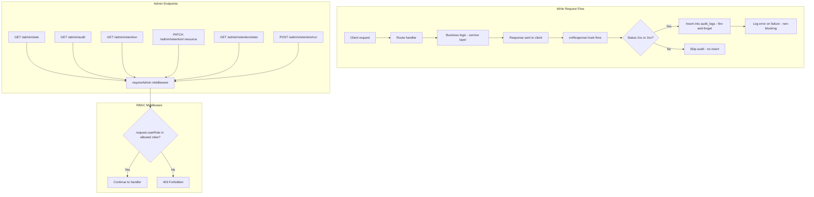
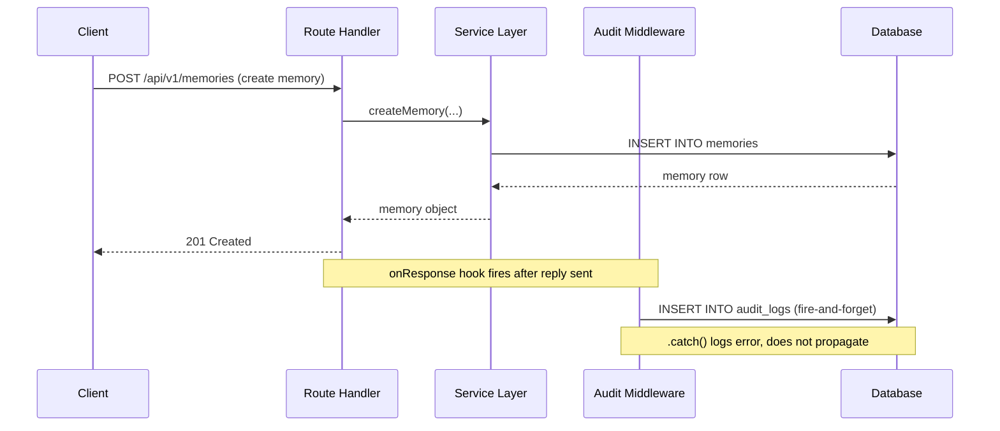

# Admin & Audit — Design

## Architecture





## Component Responsibilities

| Component | File | Responsibility |
|---|---|---|
| Admin routes | `packages/api/src/routes/admin.ts` | System stats, audit log listing, retention policy CRUD |
| Audit service | `packages/api/src/services/audit.service.ts` | `logAudit()` insert, `getAuditLogs()` query with retention filtering |
| Audit middleware | `packages/api/src/middleware/audit.ts` | `auditLog(action, resourceType)` factory — onResponse hook |
| RBAC middleware | `packages/api/src/middleware/rbac.ts` | `requireRole(...roles)` and `requireAdmin()` preHandler guards |
| DB schema | `packages/api/src/db/schema.ts` | `auditLogs` table, `retentionPolicies` table |
| Shared schemas | `packages/shared/src/validation.ts` | `updateRetentionPolicySchema` |

## API Contracts

### 1. `GET /api/v1/admin/stats` — System statistics

**Auth**: JWT + admin role
**Middleware**: `authMiddleware`, `requireAdmin()`

**Response**: `200 OK`

```json
{
  "users": 42,
  "groups": 8,
  "projects": 15,
  "memories": 327,
  "sessions": 94
}
```

Each count is a `SELECT count(*)` from the respective table. Counts include all rows (no filtering by archived status or active state).

### 2. `GET /api/v1/admin/audit` — Query audit logs

**Auth**: JWT + admin role
**Middleware**: `authMiddleware`, `requireAdmin()`

**Query parameters**:

| Param | Type | Default | Description |
|---|---|---|---|
| `userId` | uuid (optional) | — | Filter by acting user |
| `resourceType` | string (optional) | — | Filter by resource type (e.g., `memory`, `session`, `group`) |
| `limit` | integer (optional) | 50 | Page size |
| `offset` | integer (optional) | 0 | Page offset |

**Behavior**: Returns audit logs filtered by `archivedAt IS NULL` (retention-aware). Ordered by `createdAt DESC`.

**Response**: `200 OK`

```json
[
  {
    "id": "uuid",
    "userId": "uuid | null",
    "action": "create",
    "resourceType": "memory",
    "resourceId": "uuid | null",
    "details": null,
    "ipAddress": "192.168.1.1",
    "createdAt": "ISO-8601",
    "archivedAt": null
  }
]
```

### 3. `GET /api/v1/admin/retention` — List retention policies

**Auth**: JWT + admin role

**Response**: `200 OK` — Array of all retention policy records.

```json
[
  {
    "id": "uuid",
    "resource": "session_events",
    "days": 90,
    "enabled": true,
    "updatedAt": "ISO-8601",
    "updatedBy": "uuid | null"
  }
]
```

### 4. `PATCH /api/v1/admin/retention/:resource` — Update retention policy

**Auth**: JWT + admin role

**URL parameter**: `resource` — one of `session_events`, `memory_versions`, `audit_logs`

**Request body** (validated by `updateRetentionPolicySchema`):

```json
{
  "days": 180,
  "enabled": true
}
```

Both fields are optional. `days` must be between 1 and 3650.

**Response**: `200 OK` — Updated policy object.
**Error**: `404` if resource policy not found.

### 5. `GET /api/v1/admin/retention/stats` — Retention statistics

**Auth**: JWT + admin role

**Response**: `200 OK` — Active vs archived row counts per resource table.

### 6. `POST /api/v1/admin/retention/run` — Trigger manual cleanup

**Auth**: JWT + admin role

**Response**: `200 OK`

```json
{
  "archived": {
    "session_events": 150,
    "memory_versions": 23,
    "audit_logs": 87
  }
}
```

## Audit Middleware Design

The `auditLog` function in `packages/api/src/middleware/audit.ts` is a factory that returns a Fastify `onResponse` hook handler.

### Registration pattern

```typescript
app.post(
  "/api/v1/memories",
  { preHandler: [authMiddleware], onResponse: auditLog("create", "memory") },
  handler
);
```

### Hook behavior

1. The hook fires **after** the response has been sent to the client (via `onResponse`).
2. It checks `reply.statusCode` — only `2xx` and `3xx` responses are logged. Errors (`4xx`/`5xx`) are skipped.
3. It performs a **fire-and-forget** insert into `audit_logs`:
   - `userId` — from `request.userId` (set by `authMiddleware`)
   - `action` — the action string passed to the factory (e.g., `"create"`, `"update"`, `"delete"`)
   - `resourceType` — the resource string passed to the factory (e.g., `"memory"`, `"session"`)
   - `resourceId` — extracted from `request.params.id` (if present)
   - `ipAddress` — from `request.ip`
4. If the insert fails, the error is caught and logged via `request.log.error()`. It does **not** propagate or affect the client response.

### Auditable actions across the codebase

| Route file | Endpoint | Action | Resource Type |
|---|---|---|---|
| `memories.ts` | `POST /memories` | `create` | `memory` |
| `memories.ts` | `PATCH /memories/:id` | `update` | `memory` |
| `memories.ts` | `DELETE /memories/:id` | `delete` | `memory` |
| `memories.ts` | `POST /memories/share` | `share` | `memory` |
| `memories.ts` | `DELETE /memories/shares/:shareId` | `unshare` | `memory` |
| `sessions.ts` | `POST /sessions` | `create` | `session` |
| `sessions.ts` | `POST /sessions/:id/end` | `end` | `session` |

Additional auditable routes (from groups, projects, repos) follow the same pattern: `onResponse: auditLog(action, resourceType)`.

## RBAC Middleware Design

The `packages/api/src/middleware/rbac.ts` module provides two functions:

### `requireRole(...roles: string[])`

Returns a Fastify `preHandler` that checks `request.userRole` against the provided role list. If the user's role is not in the list, it responds with `403 Forbidden`:

```json
{ "error": "Insufficient permissions" }
```

### `requireAdmin()`

Convenience wrapper that calls `requireRole("admin")`. Used on all `/api/v1/admin/*` routes.

### Role resolution

`request.userRole` is set by `authMiddleware` during JWT/PAT verification. The value comes from the `users.role` column which is either `"student"` or `"admin"`.

## Data Models

### `audit_logs` table

```
audit_logs
├── id             uuid PK
├── user_id        uuid FK → users.id (nullable)
├── action         text NOT NULL
├── resource_type  text NOT NULL
├── resource_id    text (nullable)
├── details        jsonb (nullable)
├── ip_address     text (nullable)
├── created_at     timestamptz NOT NULL DEFAULT now()
└── archived_at    timestamptz (nullable)
```

Indexes:
- `idx_audit_logs_user` on `user_id`
- `idx_audit_logs_archived` partial index on `archived_at` WHERE `archived_at IS NULL`

### `retention_policies` table

```
retention_policies
├── id          uuid PK
├── resource    text NOT NULL UNIQUE
├── days        integer NOT NULL DEFAULT 90
├── enabled     boolean NOT NULL DEFAULT true
├── updated_at  timestamptz NOT NULL DEFAULT now()
└── updated_by  uuid FK → users.id (nullable)
```

Resources: `session_events`, `memory_versions`, `audit_logs`.

### Retention integration

The `getAuditLogs` function always applies `isNull(auditLogs.archivedAt)` as a base condition. The retention scheduler sets `archived_at` in batch UPDATE operations (1000 rows per batch) for rows older than the configured retention period.

## Design Decisions & Trade-offs

### Audit middleware uses onResponse hook (no request latency impact)

The audit insert happens **after** the response is sent, so it adds zero latency to the client-facing request. The trade-off is that audit logging is not transactional with the business operation — if the server crashes between sending the response and executing the audit insert, the log entry is lost. This is acceptable because audit logs are informational, not critical path.

### Fire-and-forget insert with error swallowing

The audit middleware calls `db.insert(...).catch(...)` without `await`. This means:
- The insert runs asynchronously after the response
- Failures are logged but never propagate
- No retry mechanism exists for failed inserts

This design prioritizes throughput and simplicity over guaranteed delivery. A more robust approach would use a message queue, but that is out of scope for the current phase.

### Only successful (2xx/3xx) responses are logged

The `if (reply.statusCode >= 400) return` guard skips audit logging for failed requests. This keeps the audit log focused on actions that actually changed system state. Validation errors, auth failures, and not-found responses do not produce audit entries. The trade-off is reduced visibility into failed access attempts (which would be useful for security auditing).

### No admin sub-roles

The RBAC system supports exactly two roles: `student` and `admin`. There are no granular admin permissions (e.g., "audit viewer" vs. "retention manager"). All admin endpoints require the `admin` role. This keeps the authorization model simple but means that any admin can perform all administrative actions including running retention cleanup and viewing all audit logs.

### resourceId extracted from `request.params.id`

The audit middleware extracts `resourceId` from `(request.params as Record<string, string>)?.id`. This works for routes like `PATCH /memories/:id` and `DELETE /memories/:id` where the param is named `id`. For routes without an `id` param (e.g., `POST /memories`, `POST /memories/share`), `resourceId` is `undefined` in the audit log. The actual resource ID could be extracted from the response body, but this would require parsing the response after serialization.

### System stats are raw counts

The `GET /admin/stats` endpoint performs five separate `SELECT count(*)` queries. These are not cached and not filtered (they count all rows including soft-archived rows). For a small-scale deployment (thesis students), this is adequate. For larger scale, these counts should be cached or use approximate counts.

## Non-Functional Requirements

| NFR | Requirement |
|---|---|
| Zero latency impact | Audit logging via `onResponse` hook, after reply is sent |
| Fault tolerance | Audit insert failures are caught and logged, never propagate to client |
| Retention compliance | Audit log queries filter by `archivedAt IS NULL`; expired rows archived by scheduler |
| Access control | All admin endpoints gated by `requireAdmin()` preHandler |
| Pagination | Audit log queries support `limit` (default 50) and `offset` (default 0) |
| Ordering | Audit logs returned in `createdAt DESC` order |
| Traceability | Each audit entry captures `userId`, `action`, `resourceType`, `resourceId`, `ipAddress` |
| Extensibility | Adding new auditable actions requires only adding `onResponse: auditLog(action, resource)` to the route config |
