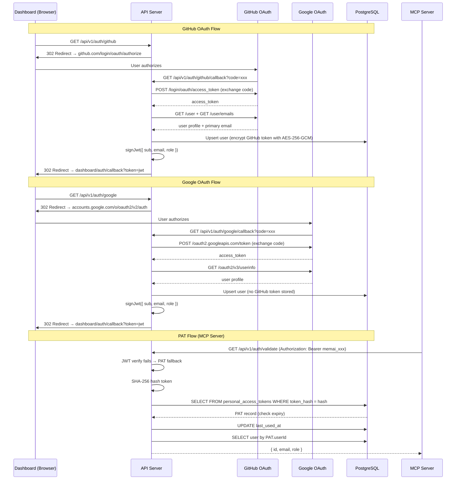

# Auth & OAuth — Design

## Overview

MemAI supports two authentication flows: OAuth (GitHub and Google) for dashboard users, and Personal Access Tokens (PATs) for MCP server (agent CLI) authentication. OAuth produces a JWT that the dashboard stores client-side. PATs are SHA-256 hashed before storage and matched at request time. The auth middleware tries JWT verification first, then falls back to PAT lookup.

## Architecture



## Component Responsibilities

| Component | File | Responsibility |
|---|---|---|
| Auth routes | `packages/api/src/routes/auth.ts` | 9 endpoints: OAuth initiation/callback (GitHub + Google), current user, PAT CRUD, token validation |
| Auth middleware | `packages/api/src/middleware/auth.ts` | Extracts `Authorization: Bearer <token>` header, tries JWT then PAT, decorates request with `userId`, `userRole`, `userEmail` |
| JWT module | `packages/api/src/auth/jwt.ts` | `signJwt` (HS256, 7-day expiry) and `verifyJwt` using `jsonwebtoken` library |
| PAT module | `packages/api/src/auth/pat.ts` | `generatePat` (prefix `memai_` + 32 random bytes hex) and `hashPat` (SHA-256) |
| GitHub OAuth | `packages/api/src/auth/github.ts` | OAuth URL generation (scopes: `user:email repo`), code exchange, user + email fetching |
| Google OAuth | `packages/api/src/auth/google.ts` | OAuth URL generation (scopes: `openid email profile`), code exchange, userinfo fetching |
| GitHub service | `packages/api/src/services/github.service.ts` | `encryptToken` / `decryptToken` (AES-256-GCM) for GitHub access token storage |

## API Contracts

### OAuth Endpoints

| Method | Path | Auth | Input | Output | Description |
|---|---|---|---|---|---|
| GET | `/api/v1/auth/github` | None | — | 302 redirect to `github.com/login/oauth/authorize` with `client_id`, `redirect_uri`, `scope=user:email repo`, `state` | Initiates GitHub OAuth flow |
| GET | `/api/v1/auth/github/callback` | None | Query: `code` (string) | 302 redirect to `{DASHBOARD_URL}/auth/callback?token={jwt}` | Exchanges code, upserts user (stores encrypted GitHub access token), issues JWT |
| GET | `/api/v1/auth/google` | None | — | 302 redirect to `accounts.google.com/o/oauth2/v2/auth` with `client_id`, `redirect_uri`, `response_type=code`, `scope=openid email profile`, `state` | Initiates Google OAuth flow |
| GET | `/api/v1/auth/google/callback` | None | Query: `code` (string) | 302 redirect to `{DASHBOARD_URL}/auth/callback?token={jwt}` | Exchanges code, upserts user (no GitHub token), issues JWT |

### Current User Endpoint

| Method | Path | Auth | Input | Output | Description |
|---|---|---|---|---|---|
| GET | `/api/v1/auth/me` | JWT/PAT | — | User object (excludes `githubAccessTokenEnc`) | Returns authenticated user's profile |

### PAT Management Endpoints

| Method | Path | Auth | Input | Output | Description |
|---|---|---|---|---|---|
| POST | `/api/v1/auth/tokens` | JWT/PAT | `{ name: string, expiresInDays?: number }` | `{ id, name, token, expiresAt, createdAt }` (201) | Creates a new PAT. The raw `token` value (prefix `memai_`) is returned exactly once and never stored. |
| GET | `/api/v1/auth/tokens` | JWT/PAT | — | `Array<{ id, name, lastUsedAt, expiresAt, createdAt }>` | Lists all PATs for the authenticated user (no hash or raw token exposed) |
| DELETE | `/api/v1/auth/tokens/:id` | JWT/PAT | — | 204 No Content | Revokes (deletes) a PAT |

### Token Validation Endpoint

| Method | Path | Auth | Input | Output | Description |
|---|---|---|---|---|---|
| GET | `/api/v1/auth/validate` | JWT/PAT | — | `{ id, email, role }` | Validates the token and returns user identity. Used by MCP server on startup. |

### Error Responses

| Status | Condition |
|---|---|
| 400 | Missing `code` query parameter in OAuth callback |
| 401 | Missing authorization header, invalid/expired JWT, invalid/expired PAT |

## Data Models

### `users` table (auth-relevant columns)

```
users
├── id                      uuid PK
├── email                   text UNIQUE NOT NULL
├── name                    text NOT NULL
├── avatar_url              text
├── role                    text NOT NULL DEFAULT 'student' ('student' | 'admin')
├── github_id               text UNIQUE (nullable — set on GitHub OAuth)
├── google_id               text UNIQUE (nullable — set on Google OAuth)
├── github_access_token_enc text (nullable — AES-256-GCM encrypted, only from GitHub OAuth)
├── created_at              timestamptz NOT NULL DEFAULT now()
└── updated_at              timestamptz NOT NULL DEFAULT now()
```

User upsert logic: match on `github_id` OR `email` (GitHub), or `google_id` OR `email` (Google). Existing users are updated with the latest profile info and provider ID.

### `personal_access_tokens` table

```
personal_access_tokens
├── id          uuid PK
├── user_id     uuid FK → users.id (CASCADE)
├── name        text NOT NULL
├── token_hash  text UNIQUE NOT NULL (SHA-256 hex digest)
├── last_used_at timestamptz (nullable, updated on each use)
├── expires_at  timestamptz (nullable, null means never expires)
└── created_at  timestamptz NOT NULL DEFAULT now()
```

### JWT Payload

```typescript
interface JwtPayload {
  sub: string;   // user.id (uuid)
  email: string;
  role: string;  // 'student' | 'admin'
  iat: number;   // issued at (auto)
  exp: number;   // expires (auto, 7 days from iat)
}
```

- Algorithm: HS256
- Secret: `JWT_SECRET` env var (fallback: `"dev-secret-change-me"`)
- Expiry: 7 days

### PAT Format

```
memai_<64 hex chars>
```

- Prefix: `memai_`
- Random part: 32 bytes (via `crypto.randomBytes`), hex-encoded
- Storage: Only the SHA-256 hash of the full token is stored. The raw token is returned once at creation time.

## Auth Middleware Flow

```
1. Extract Authorization header
2. Split "Bearer <token>"
3. Try JWT verify (jsonwebtoken.verify)
   ├── Success → set request.userId, userRole, userEmail from JWT payload → return
   └── Failure → continue
4. Try PAT lookup
   ├── Hash token with SHA-256
   ├── Query personal_access_tokens by token_hash
   ├── Found?
   │   ├── Check expiry (expiresAt < now → 401 "Token expired")
   │   ├── Update last_used_at
   │   ├── Lookup user by pat.userId
   │   └── Set request.userId, userRole, userEmail → return
   └── Not found → 401 "Invalid token"
```

Both JWT and PAT use the same `Bearer` scheme. The middleware distinguishes them by attempting JWT verification first (which fails fast with a try/catch for non-JWT tokens).

## Design Decisions and Trade-offs

### 1. No JWT refresh tokens

**Decision**: JWTs are issued with a 7-day expiry and there is no refresh token endpoint.

**Rationale**: Simplifies the auth flow for an internal thesis tool. Users re-authenticate via OAuth after expiry.

**Trade-off**: Users must re-login every 7 days. No way to extend a session without a full OAuth round-trip.

### 2. CSRF state parameter not validated

**Decision**: A random `state` parameter is generated for OAuth redirects, but the callback does not validate it against a stored value.

**Rationale**: Marked with a TODO comment ("In production, store state in a short-lived cookie/session for CSRF protection"). Not yet implemented.

**Trade-off**: Vulnerable to CSRF attacks where an attacker could initiate an OAuth flow and trick a user into completing it. Should be addressed before production deployment.

### 3. No early JWT invalidation

**Decision**: There is no JWT blocklist or revocation mechanism. Once issued, a JWT is valid until it expires.

**Rationale**: Stateless JWT verification is simpler and avoids the need for a token store or Redis-backed blocklist.

**Trade-off**: If a user account is compromised, there is no way to invalidate existing JWTs before their 7-day expiry. PATs can be revoked immediately via DELETE.

### 4. Google OAuth users cannot use GitHub features

**Decision**: Google OAuth stores `googleId` and profile info but does not store a GitHub access token.

**Rationale**: Google OAuth does not provide a GitHub token. Only GitHub OAuth provides the access token needed for repo operations.

**Trade-off**: Users who sign up via Google cannot connect GitHub repos, push memories to repos, or use any GitHub integration features unless they also link their GitHub account.

### 5. Single Bearer scheme for both JWT and PAT

**Decision**: Both JWTs and PATs use `Authorization: Bearer <token>`. The middleware tries JWT first, then PAT.

**Rationale**: Standard Bearer auth works with all HTTP clients and MCP server tooling without custom scheme handling.

**Trade-off**: Every request with a PAT incurs a failed JWT verify attempt before the PAT lookup. This is negligible in practice (JWT verify failure is synchronous and fast).

### 6. GitHub OAuth scopes include `repo`

**Decision**: The GitHub OAuth scope requests `user:email repo`.

**Rationale**: The `repo` scope is needed for webhook creation, file reading, and file pushing on private repositories.

**Trade-off**: This is a broad scope. Users must trust MemAI with full repo access. A more granular approach would use GitHub Apps with installation-level permissions, but this adds significant complexity.

## Non-Functional Requirements to Preserve

- **Security**: GitHub access tokens must be encrypted with AES-256-GCM before database storage. PAT raw values must never be stored; only SHA-256 hashes are persisted. The `githubAccessTokenEnc` field must be excluded from the `/auth/me` response.
- **Statelessness**: JWT verification must remain stateless (no database lookup) for fast middleware performance on every request.
- **PAT auditing**: `lastUsedAt` must be updated on every PAT authentication for monitoring and compliance.
- **User merge safety**: OAuth upsert matches on provider ID OR email to prevent duplicate accounts when a user signs in with a different provider that shares the same email.
- **Expiry enforcement**: PAT expiry must be checked on every authentication attempt, rejecting expired tokens with 401.
