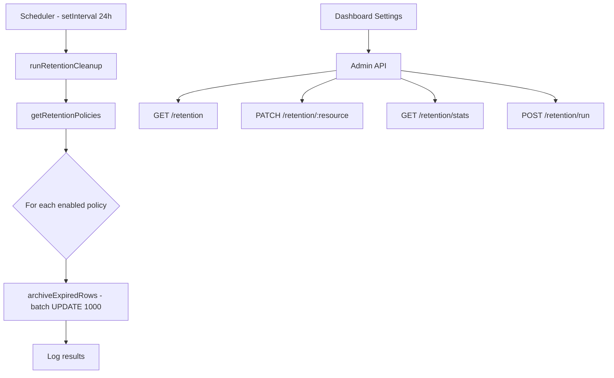

# Data Retention — Design

## Schema

### New table: `retention_policies`

```
retention_policies
├── id          uuid PK
├── resource    text UNIQUE  ('session_events' | 'memory_versions' | 'audit_logs')
├── days        integer DEFAULT 90
├── enabled     boolean DEFAULT true
├── updated_at  timestamptz DEFAULT now()
└── updated_by  uuid FK → users.id
```

### Added columns

`archived_at timestamptz` added to: `session_events`, `memory_versions`, `audit_logs`

### Indexes

Partial indexes on `archived_at` WHERE `archived_at IS NULL` for efficient cleanup queries.

## Architecture



## API Design

| Method | Path | Auth | Description |
|---|---|---|---|
| GET | `/api/v1/admin/retention` | admin | List all retention policies |
| PATCH | `/api/v1/admin/retention/:resource` | admin | Update policy (days, enabled) |
| GET | `/api/v1/admin/retention/stats` | admin | Active vs archived row counts |
| POST | `/api/v1/admin/retention/run` | admin | Trigger manual cleanup |

## Service Layer

`retention.service.ts` provides:
- `getRetentionPolicies()` — read all policies
- `updateRetentionPolicy(resource, updates, updatedBy)` — admin update
- `archiveExpiredRows(resource, days)` — batch soft-delete with LIMIT 1000
- `getRetentionStats()` — count active vs archived per table
- `runRetentionCleanup(logger?)` — orchestrate full cleanup run

## Query Filtering

All existing read queries on the 3 affected tables add `WHERE archived_at IS NULL` via Drizzle's `isNull()` operator.
