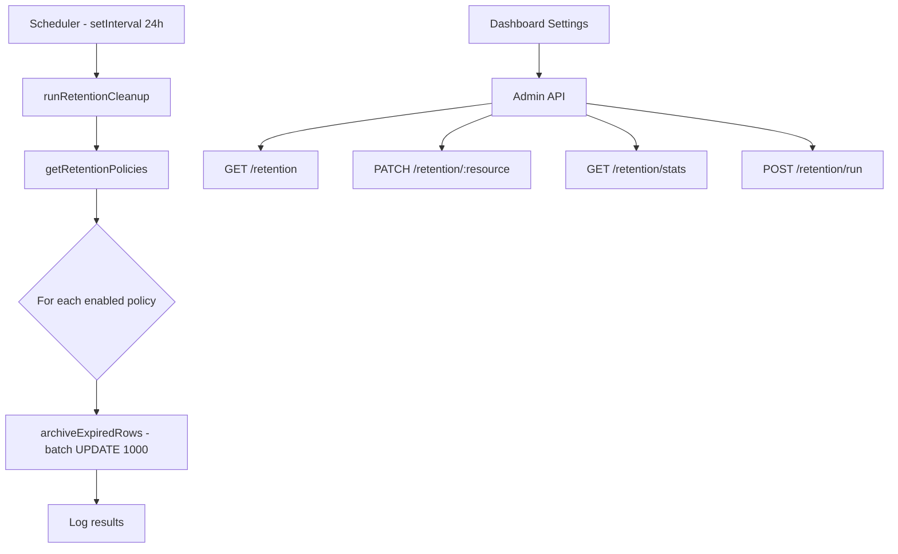

# Data Retention — Design

## Schema

### New table: `retention_policies`

```
retention_policies
├── id          uuid PK
├── resource    text UNIQUE  ('session_events' | 'memory_versions' | 'audit_logs')
├── days        integer DEFAULT 90
├── enabled     boolean DEFAULT true
├── updated_at  timestamptz DEFAULT now()
└── updated_by  uuid FK → users.id
```

### Added columns

`archived_at timestamptz` added to: `session_events`, `memory_versions`, `audit_logs`

### Indexes

Partial indexes on `archived_at` WHERE `archived_at IS NULL` for efficient cleanup queries.

## Architecture



## API Design

| Method | Path | Auth | Description |
|---|---|---|---|
| GET | `/api/v1/admin/retention` | admin | List all retention policies |
| PATCH | `/api/v1/admin/retention/:resource` | admin | Update policy (days, enabled) |
| GET | `/api/v1/admin/retention/stats` | admin | Active vs archived row counts |
| POST | `/api/v1/admin/retention/run` | admin | Trigger manual cleanup |

## Service Layer

`retention.service.ts` provides:
- `getRetentionPolicies()` — read all policies
- `updateRetentionPolicy(resource, updates, updatedBy)` — admin update
- `archiveExpiredRows(resource, days)` — batch soft-delete with LIMIT 1000
- `getRetentionStats()` — count active vs archived per table
- `runRetentionCleanup(logger?)` — orchestrate full cleanup run

## Query Filtering

All existing read queries on the 3 affected tables add `WHERE archived_at IS NULL` via Drizzle's `isNull()` operator.

## Design Decisions & Trade-offs

### Soft-delete via `archived_at` instead of hard delete

Rows are marked with an `archived_at` timestamp rather than permanently deleted. This preserves data for potential audits or recovery while keeping active queries fast via partial indexes. The trade-off is that storage is not immediately reclaimed — a future hard-delete pass could be added if disk usage becomes a concern.

### Batch size of 1000 rows per cleanup pass

The `archiveExpiredRows` function uses `LIMIT 1000` to avoid long-running transactions that could block concurrent reads. If more than 1000 rows are expired, they are cleaned up across subsequent scheduler runs (every 24h). This favors operational stability over immediate completeness.

### Scheduler uses `setInterval` instead of a job queue

A simple `setInterval(24h)` drives the cleanup cycle. This avoids introducing a dependency on an external job scheduler (e.g., pg-cron, BullMQ) but means cleanup timing drifts if the server restarts. For a low-frequency background task this is an acceptable trade-off.

### Per-resource policy granularity

Each of the three resource types (`session_events`, `memory_versions`, `audit_logs`) has its own retention policy with independent `days` and `enabled` settings. This gives admins fine-grained control without over-complicating the schema.

## Non-Functional Requirements

| NFR | Requirement |
|---|---|
| Minimal query impact | Partial indexes on `archived_at IS NULL` ensure active-row queries are not degraded by archived data |
| Batch safety | Cleanup operations use `LIMIT 1000` to bound transaction duration and lock contention |
| Admin-only access | All retention endpoints gated by `requireAdmin()` preHandler |
| Configurability | Retention period (days) and enabled/disabled toggle per resource type |
| Observability | Cleanup runs log row counts per resource; stats endpoint exposes active vs archived counts |
| Fault tolerance | Cleanup failures are logged but do not crash the server or affect request handling |
