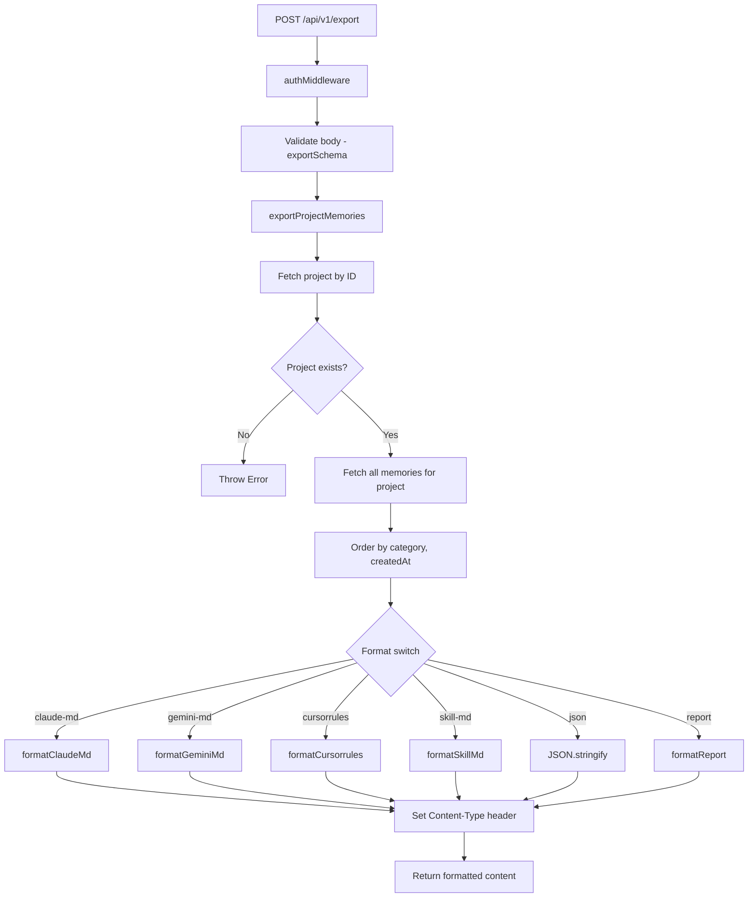

# Export Feature — Design

## Architecture



## Component Responsibilities

| Component | File | Responsibility |
|---|---|---|
| Route handler | `packages/api/src/routes/export.ts` | Request validation, content-type mapping, response dispatch |
| Export service | `packages/api/src/services/export.service.ts` | Project lookup, memory fetching, format-specific rendering |
| Shared schema | `packages/shared/src/validation.ts` | `exportSchema` Zod validation (projectId + format) |
| Constants | `packages/shared/src/constants.ts` | `EXPORT_FORMATS` enum definition |

## API Contract

### `POST /api/v1/export`

**Auth**: JWT (any authenticated user)

**Request body** (validated by `exportSchema`):

```json
{
  "projectId": "uuid",
  "format": "claude-md | gemini-md | cursorrules | skill-md | json | report"
}
```

**Response**: Raw formatted content (not JSON-wrapped).

**Content-Type mapping**:

| Format | Content-Type |
|---|---|
| `claude-md` | `text/markdown` |
| `gemini-md` | `text/markdown` |
| `cursorrules` | `text/plain` |
| `skill-md` | `text/markdown` |
| `json` | `application/json` |
| `report` | `text/markdown` |

**Error responses**:

| Status | Condition |
|---|---|
| 400 | Invalid body (Zod validation failure) |
| 401 | Missing or invalid JWT |
| 500 | Project not found (thrown as unhandled Error) |

## Format Templates

All formats receive memories sorted by `category` then `createdAt` (the query-level ordering). Formats that group by category use a `groupByCategory` helper that preserves insertion order.

### `claude-md`

```markdown
# {projectName}

## {Category}

### {memory.title}
{memory.content}

### {memory.title}
{memory.content}

## {Category}
...
```

Grouped by category. Each category becomes an H2 heading (capitalized). Each memory becomes an H3 with its content below.

### `gemini-md`

```markdown
# {projectName} — Project Context

- **{memory.title}**: {memory.content}
- **{memory.title}**: {memory.content}
```

Flat list. No category grouping. Each memory is a single bullet with bold title and inline content.

### `cursorrules`

```
# {memory.title}
{memory.content}

# {memory.title}
{memory.content}
```

Flat list. No project name header. No category grouping. Each memory is an H1 with its content below. Content-Type is `text/plain`.

### `skill-md`

```markdown
# {projectName} — Skill Knowledge

## {Category}

### {memory.title} [{tag1}, {tag2}]
{memory.content}

## {Category}
...
```

Grouped by category, same as `claude-md`, but each memory H3 heading is suffixed with a bracketed tag list (e.g., `[api, auth]`). Tags are only appended if the memory has at least one tag.

### `json`

```json
[
  {
    "id": "uuid",
    "projectId": "uuid",
    "userId": "uuid",
    "title": "string",
    "content": "string",
    "category": "string",
    "sourceAgent": "string | null",
    "tags": ["string"],
    "isPinned": false,
    "version": 1,
    "embedding": null,
    "createdAt": "ISO-8601",
    "updatedAt": "ISO-8601"
  }
]
```

Raw `JSON.stringify(memories, null, 2)`. Contains all database columns including `embedding` (typically `null` until Phase 5).

### `report`

```markdown
# Memory Report: {projectName}
Generated: {ISO-8601 timestamp}
Total memories: {count}

## {Category} ({count})

### {memory.title}
{memory.content}

## {Category} ({count})
...
```

Similar to `claude-md` but includes a report header with generation timestamp and total memory count. Category headings include item counts.

## Data Model

The export feature reads from two existing tables and creates no new tables.

**Read: `projects`**

| Column | Used |
|---|---|
| `id` | Lookup by `projectId` |
| `name` | Used in format headers |

**Read: `memories`**

| Column | Used |
|---|---|
| `projectId` | Filter clause |
| `title` | Rendered in all formats |
| `content` | Rendered in all formats |
| `category` | Grouping key, sort key |
| `tags` | Used in `skill-md` format |
| `createdAt` | Secondary sort key |
| All columns | Included in `json` format |

Query: `WHERE memories.projectId = :projectId ORDER BY category, createdAt`.

## Design Decisions & Trade-offs

### Synchronous export (no streaming)

All memories for a project are fetched in a single query and formatted in-memory before responding. This is simple and appropriate for the expected dataset size (tens to low hundreds of memories per project). If projects grow to thousands of memories, this would need to be replaced with streaming or pagination.

### No authorization check on project membership

The route uses `authMiddleware` for authentication but does not verify that the requesting user belongs to the project's group. Any authenticated user who knows a `projectId` can export it. This is a known simplification; project-scoped authorization should be added in a hardening phase.

### Format-specific functions vs. template engine

Each format is a standalone function rather than using a template engine (Handlebars, EJS, etc.). This keeps the dependency footprint minimal and makes each format independently testable. The trade-off is code duplication in the grouping logic.

### `skill-md` includes tags in headers

The `skill-md` format appends tags to memory titles (e.g., `### Title [api, auth]`) because skill files are designed for quick scanning by AI agents that benefit from inline metadata. Other formats omit tags for cleaner human readability.

### `cursorrules` uses `text/plain`

Cursor's `.cursorrules` file format is plain text, not Markdown. The export reflects this by using `text/plain` content type and H1 headings without Markdown-specific features like bold or links.

### Fallback to JSON

If an unknown format value somehow passes validation, the `default` case in the switch returns `JSON.stringify`. This is a defensive fallback; the Zod `exportSchema` enum validation should prevent this from ever executing.

## Non-Functional Requirements

| NFR | Requirement |
|---|---|
| Latency | Single DB query + in-memory formatting; sub-100ms for typical project sizes |
| Correctness | Memories sorted deterministically (category ASC, createdAt ASC) |
| Consistency | `groupByCategory` preserves insertion order from the sorted query |
| Extensibility | New formats require one new function + one switch case + one content-type entry |
| Security | JWT authentication required; no audit logging on read-only export |
| Encoding | UTF-8 response body; no BOM |
