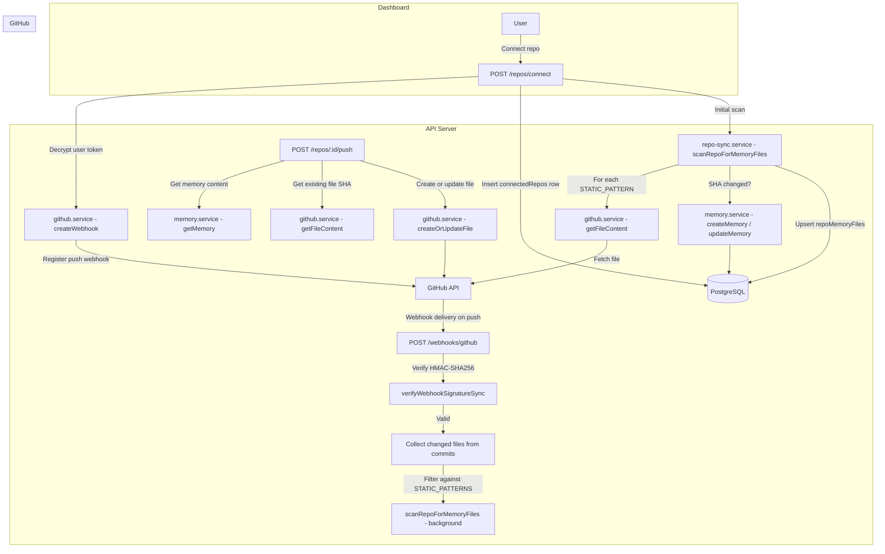

# GitHub Integration — Design

## Overview

The GitHub integration connects user repositories to MemAI projects, enabling bidirectional sync of agent memory files. Repositories are linked via the GitHub API using the user's OAuth access token (encrypted at rest with AES-256-GCM). Incoming push events are verified with HMAC-SHA256 webhook signatures and trigger automatic memory file scanning and upsert. Users can also push memories back to repos as files.

## Architecture



## Component Responsibilities

| Component | File | Responsibility |
|---|---|---|
| Repo routes | `packages/api/src/routes/repos.ts` | 7 REST endpoints for repo CRUD, scanning, and push |
| Webhook routes | `packages/api/src/routes/webhooks.ts` | Receives GitHub push webhooks, verifies signature, dispatches sync |
| GitHub service | `packages/api/src/services/github.service.ts` | Token encryption/decryption (AES-256-GCM), GitHub API calls (repos, files, webhooks), webhook signature verification (HMAC-SHA256) |
| Repo sync service | `packages/api/src/services/repo-sync.service.ts` | Scans repos for known memory file patterns, creates/updates memories, manages `repoMemoryFiles` tracking records |
| Shared constants | `packages/shared/src/constants.ts` | `MEMORY_FILE_PATTERNS` array defining known agent memory file paths |
| Shared validation | `packages/shared/src/validation.ts` | `connectRepoSchema` and `pushToRepoSchema` Zod schemas |

## API Contracts

### Repo Endpoints

| Method | Path | Auth | Input | Output | Description |
|---|---|---|---|---|---|
| GET | `/api/v1/repos/available` | JWT/PAT | — | `Array<{ id, name, fullName, owner, defaultBranch, private }>` | List user's GitHub repos (fetched live from GitHub API, max 100, sorted by updated) |
| GET | `/api/v1/repos` | JWT/PAT | — | `Array<ConnectedRepo & { memoryFiles }>` | List connected repos for the authenticated user, including tracked memory files |
| POST | `/api/v1/repos/connect` | JWT/PAT | `{ githubRepoId: number, owner: string, name: string, fullName: string, defaultBranch?: string, projectId?: uuid }` | `ConnectedRepo` (201) | Connect a repo: registers webhook, inserts DB row, triggers initial scan if projectId provided |
| DELETE | `/api/v1/repos/:id` | JWT/PAT | — | 204 No Content | Disconnect a repo: removes GitHub webhook (best-effort), deletes DB row |
| GET | `/api/v1/repos/:id/files` | JWT/PAT | — | `Array<RepoMemoryFile>` | List tracked memory files for a connected repo |
| POST | `/api/v1/repos/:id/sync` | JWT/PAT | — | `{ synced: number, files: Array<{ filePath, agentType, content, sha }> }` | Manual re-scan of a connected repo for memory files |
| POST | `/api/v1/repos/:id/push` | JWT/PAT | `{ memoryId: uuid, filePath: string }` | `{ success: true, filePath: string }` | Push a memory's content to a file in the connected repo (creates or updates via GitHub Contents API) |

### Webhook Endpoint

| Method | Path | Auth | Input | Output | Description |
|---|---|---|---|---|---|
| POST | `/api/v1/webhooks/github` | HMAC-SHA256 signature | GitHub push event payload (`x-github-event: push`, `x-hub-signature-256` header, JSON body with `ref`, `repository.id`, `commits[].added/modified/removed`) | `{ message: "Processing" }` (200) or `{ message: "Ignored event" }` for non-push events | Receives push webhooks, verifies signature against stored `webhookSecret`, extracts changed files from `added` + `modified` arrays, triggers background re-scan |

### Error Responses

| Status | Condition |
|---|---|
| 400 | User has no GitHub token (not logged in via GitHub OAuth) |
| 401 | Missing or invalid webhook signature |
| 404 | Repo not found / Repo not connected / Memory not found |

## Data Models

### `connected_repos` table

```
connected_repos
├── id              uuid PK
├── user_id         uuid FK → users.id (CASCADE)
├── github_repo_id  bigint NOT NULL
├── owner           text NOT NULL
├── name            text NOT NULL
├── full_name       text NOT NULL
├── default_branch  text NOT NULL DEFAULT 'main'
├── webhook_id      bigint (nullable — null if webhook creation failed)
├── webhook_secret  text NOT NULL (64-char hex, generated via randomBytes(32))
├── project_id      uuid FK → projects.id (nullable)
├── is_active       boolean NOT NULL DEFAULT true
├── last_synced_at  timestamptz (nullable)
└── created_at      timestamptz NOT NULL DEFAULT now()

UNIQUE(user_id, github_repo_id)
INDEX idx_connected_repos_user ON (user_id)
```

### `repo_memory_files` table

```
repo_memory_files
├── id              uuid PK
├── repo_id         uuid FK → connected_repos.id (CASCADE)
├── file_path       text NOT NULL
├── file_sha        text (nullable — Git blob SHA for dedup)
├── agent_type      text (nullable — e.g. 'claude-code', 'cursor')
├── memory_id       uuid FK → memories.id (SET NULL on delete)
├── last_synced_at  timestamptz (nullable)
└── created_at      timestamptz NOT NULL DEFAULT now()

UNIQUE(repo_id, file_path)
INDEX idx_repo_files_repo ON (repo_id)
```

### Token Encryption Format

GitHub access tokens are encrypted using AES-256-GCM before storage in `users.github_access_token_enc`:

```
<iv_hex>:<auth_tag_hex>:<ciphertext_hex>
```

- `ENCRYPTION_KEY` env var: 64-char hex string (32 bytes)
- IV: 12 random bytes per encryption
- Auth tag: GCM authentication tag for integrity verification

### Memory File Patterns (Static Only)

The sync service filters `MEMORY_FILE_PATTERNS` from `@memai/shared` to only include non-glob paths:

| Path | Agent Type |
|---|---|
| `CLAUDE.md` | claude-code |
| `.claude/CLAUDE.md` | claude-code |
| `GEMINI.md` | gemini-cli |
| `.gemini/GEMINI.md` | gemini-cli |
| `.cursorrules` | cursor |
| `MEMORY.md` | generic |
| `memory.md` | generic |

The wildcard pattern `.kilocode/rules/**/*.md` is excluded because the scan uses direct GitHub Contents API fetches by exact path (no directory listing or glob expansion).

## Design Decisions and Trade-offs

### 1. Wildcard patterns skipped

**Decision**: Only static (exact-path) patterns from `MEMORY_FILE_PATTERNS` are used. The `.kilocode/rules/**/*.md` glob pattern is filtered out.

**Rationale**: The GitHub Contents API only fetches individual files by path. Supporting globs would require listing directory contents recursively, adding complexity and API calls. This can be revisited if kilo-code adoption grows.

**Trade-off**: Kilo Code memory files in repos are not auto-synced.

### 2. Removed files not handled

**Decision**: The webhook handler collects only `added` and `modified` files from push commits. The `removed` array is ignored.

**Rationale**: Deleting memories when a file is removed from a repo is destructive and could cause data loss if the deletion was accidental. The current approach is append/update only.

**Trade-off**: Orphaned `repoMemoryFiles` records may accumulate if files are deleted from the repo. Manual cleanup or a future reconciliation job could address this.

### 3. Webhook creation failure is non-blocking

**Decision**: If `createWebhook` fails during repo connect, the error is logged as a warning and the connection proceeds without a webhook.

**Rationale**: Users may connect repos where they lack admin access (required for webhook creation). The repo is still usable for manual sync and push-to-repo operations.

**Trade-off**: Without a webhook, automatic sync on push does not work. The `webhookId` column will be null, and manual `/sync` calls are needed.

### 4. SHA-based deduplication

**Decision**: The sync service compares the Git blob SHA from the GitHub API against the stored `file_sha` in `repoMemoryFiles`. If they match, the file is skipped.

**Rationale**: Avoids unnecessary memory updates and version bumps when file content has not changed.

### 5. Background webhook processing

**Decision**: `handleWebhookPush` is called with `.catch()` (fire-and-forget) after the webhook response is sent.

**Rationale**: Returns `200` to GitHub quickly to avoid webhook timeout penalties. Processing errors are logged but do not affect the webhook response.

**Trade-off**: No retry mechanism for failed background processing. GitHub will redeliver the webhook on timeout, but not on a successful 200 response.

### 6. Push-to-repo uses existing SHA for updates

**Decision**: Before pushing a file, the service fetches the current file to get its SHA. If the file exists, the SHA is passed to the PUT request to update in-place.

**Rationale**: The GitHub Contents API requires the current SHA to update an existing file (optimistic concurrency control).

## Non-Functional Requirements to Preserve

- **Security**: GitHub access tokens must always be encrypted at rest (AES-256-GCM). Webhook signatures must be verified using HMAC-SHA256 with constant-time comparison (`timingSafeEqual`) before processing any payload.
- **Audit trail**: Connect and disconnect operations are tracked via `auditLog` middleware (`onResponse` hook). Push operations are also audited.
- **Graceful degradation**: Webhook creation failure does not block repo connection. Initial scan failure does not block repo connection.
- **Idempotency**: SHA-based deduplication ensures re-scanning the same unchanged file does not create duplicate versions. `repoMemoryFiles` uses `onConflictDoUpdate` (upsert) on `(repoId, filePath)`.
- **Data integrity**: `connectedRepos` has a unique constraint on `(userId, githubRepoId)` preventing duplicate connections. `repoMemoryFiles` has a unique constraint on `(repoId, filePath)`.
- **Latency**: Webhook responses are returned immediately; sync runs in the background.
