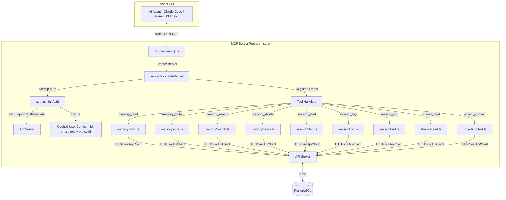

# MCP Server — Design

## Overview

The MCP server (`memai-mcp`) is an npm package that exposes 9 tools via the Model Context Protocol, enabling AI agent CLIs (Claude Code, Gemini CLI, Cursor, Kilo Code, OpenCode) to read, write, search, and delete memories, manage sessions, and access shared/project context. It authenticates once on startup using a Personal Access Token (PAT) and project ID, then caches the user context for the lifetime of the process. Communication uses stdio transport.

## Architecture

## Component Responsibilities

| Component | File | Responsibility |
|---|---|---|
| Entry point | `packages/mcp-server/src/bin/memai-mcp.ts` | Creates MCP server, connects stdio transport, handles fatal errors |
| Server factory | `packages/mcp-server/src/server.ts` | Creates `McpServer` instance, registers all 9 tools with schemas and handlers |
| Auth module | `packages/mcp-server/src/auth.ts` | Validates PAT on startup via API, caches user `{ id, email, role }` and `projectId`, exports `getUserId()` and `getProjectId()` |
| API client | `packages/mcp-server/src/apiClient.ts` | HTTP client wrapping all MemAI REST API calls with `Authorization: Bearer <token>` |
| Tool handlers | `packages/mcp-server/src/tools/*.ts` | Individual tool implementations, each exporting a Zod schema and an async handler function |

## Distribution

- **Package name**: `memai-mcp` (npm)
- **Binary**: `memai-mcp` (via `package.json` `bin` field pointing to `./dist/bin/memai-mcp.js`)
- **Transport**: stdio (JSON-RPC over stdin/stdout via `StdioServerTransport`)
- **Server info**: name `"memai"`, version `"0.1.0"`

## Environment Variables

| Variable | Required | Description |
|---|---|---|
| `MEMAI_TOKEN` | Yes | Personal Access Token (PAT) for API authentication |
| `MEMAI_PROJECT_ID` | Yes | Project UUID to scope all memory and session operations |
| `MEMAI_API_URL` | No | API server base URL (default: `http://localhost:3000`) |

## Startup Sequence

1. `memai-mcp` binary is invoked by the agent CLI
2. `createServer()` reads `MEMAI_TOKEN` from env (throws if missing)
3. `initAuth(apiClient)` is called:
   - Reads `MEMAI_PROJECT_ID` from env (throws if missing)
   - Calls `GET /api/v1/auth/validate` with the PAT
   - Caches the returned `{ id, email, role }` and `projectId` in module-level variables
4. 9 tools are registered on the `McpServer` instance
5. `StdioServerTransport` is connected
6. Server is ready to receive tool calls

If any startup step fails (missing env vars, invalid token, API unreachable), the process exits with code 1 and prints the error to stderr.

## Tool Contracts

### memory_read

Read memories from the project.

**Input schema**:
| Parameter | Type | Required | Description |
|---|---|---|---|
| `memoryId` | `string (uuid)` | No | Specific memory ID to read |
| `category` | `string` | No | Filter by category (architecture, convention, decision, preference, snippet, context, other) |
| `limit` | `number (1-50)` | No | Max results (default: 10) |

**Behavior**: If `memoryId` provided, fetches single memory via `GET /api/v1/memories/:id`. Otherwise, lists memories via `GET /api/v1/memories?projectId=...&category=...&limit=...`.

**Output**: JSON-stringified memory object(s) or `"No memories found."`.

**Error cases**: API 404 if memoryId does not exist.

---

### memory_write

Write a new memory to the project.

**Input schema**:
| Parameter | Type | Required | Description |
|---|---|---|---|
| `title` | `string (1-500)` | Yes | Title of the memory |
| `content` | `string (min 1)` | Yes | Content of the memory |
| `category` | `string` | No | Category (default: `"other"`) |
| `tags` | `string[]` | No | Tags for organizing (default: `[]`) |

**Behavior**: Creates memory via `POST /api/v1/memories` with the cached `projectId`.

**Output**: `"Memory created: {id}\nTitle: {title}\nCategory: {category}"`.

---

### memory_search

Search memories by text query.

**Input schema**:
| Parameter | Type | Required | Description |
|---|---|---|---|
| `query` | `string (min 1)` | Yes | Search query |
| `category` | `string` | No | Filter by category |
| `limit` | `number (1-50)` | No | Max results (default: 10) |

**Behavior**: Searches via `POST /api/v1/memories/search` with the cached `projectId`.

**Output**: JSON-stringified results or `"No memories found matching "{query}"."`.

---

### memory_delete

Delete a memory.

**Input schema**:
| Parameter | Type | Required | Description |
|---|---|---|---|
| `memoryId` | `string (uuid)` | Yes | ID of the memory to delete |

**Behavior**: Deletes via `DELETE /api/v1/memories/:id`.

**Output**: `"Memory {memoryId} deleted."`.

---

### session_start

Start a new agent session.

**Input schema**:
| Parameter | Type | Required | Description |
|---|---|---|---|
| `agentType` | `string` | Yes | Agent type (claude-code, gemini-cli, cursor, opencode, etc.) |
| `title` | `string` | No | Optional session title |

**Behavior**: Creates session via `POST /api/v1/sessions` with the cached `projectId`.

**Output**: `"Session started: {id}\nAgent: {agentType}\nUse this session_id for subsequent session_log and session_end calls."`.

---

### session_log

Log an event to an active session.

**Input schema**:
| Parameter | Type | Required | Description |
|---|---|---|---|
| `sessionId` | `string (uuid)` | Yes | Session ID from session_start |
| `eventType` | `enum` | Yes | One of: `message`, `tool_call`, `file_edit`, `decision`, `error` |
| `content` | `string` | Yes | Event content/description |
| `metadata` | `Record<string, unknown>` | No | Optional metadata object |

**Behavior**: Logs event via `POST /api/v1/sessions/events`.

**Output**: `"Event logged: {id} ({eventType})"`.

---

### session_end

End an active session.

**Input schema**:
| Parameter | Type | Required | Description |
|---|---|---|---|
| `sessionId` | `string (uuid)` | Yes | Session ID to end |
| `summary` | `string` | No | Optional session summary |

**Behavior**: Ends session via `POST /api/v1/sessions/:id/end`.

**Output**: `"Session {sessionId} ended."` with optional summary line.

---

### shared_read

Read memories shared with the authenticated user.

**Input schema**: Empty object (`{}`).

**Behavior**: Fetches via `GET /api/v1/memories/shared`.

**Output**: JSON-stringified shared memories or `"No shared memories available."`.

---

### project_context

Get project overview and stats.

**Input schema**: Empty object (`{}`).

**Behavior**: Fetches project via `GET /api/v1/projects/:id` using cached `projectId`.

**Output**: JSON object with `{ id, name, description, group, memoriesCount, sessionsCount }`.

## API Client

The `ApiClient` class wraps all HTTP calls to the MemAI REST API:

- Base URL: configurable via `MEMAI_API_URL`
- Auth: `Authorization: Bearer <MEMAI_TOKEN>` on every request
- Content type: `application/json`
- Error handling: Throws `Error` with status code and response body text on non-OK responses
- 204 responses: Returns `undefined`

Methods: `validateToken`, `listMemories`, `getMemory`, `createMemory`, `updateMemory`, `deleteMemory`, `searchMemories`, `getSharedMemories`, `createSession`, `addSessionEvent`, `endSession`, `getProject`.

## Design Decisions and Trade-offs

### 1. Context cached once at startup

**Decision**: User identity and project ID are resolved once during `initAuth()` and cached in module-level variables for the process lifetime.

**Rationale**: The MCP server runs as a child process of the agent CLI, typically for a single session. Re-validating on every tool call would add unnecessary latency and API load.

**Trade-off**: If the PAT is revoked or the user's role changes while the MCP server is running, the cached context will be stale. The process must be restarted to pick up changes.

### 2. No session auto-close

**Decision**: There is no mechanism to automatically end a session when the MCP server process exits.

**Rationale**: The MCP SDK does not provide reliable shutdown hooks, and agent CLIs may terminate the process abruptly (SIGKILL). Implementing cleanup is unreliable.

**Trade-off**: Sessions that are started but never explicitly ended via `session_end` will remain in an "open" state (no `endedAt` timestamp). A future cleanup job or session timeout could address this.

### 3. No rate limiting at MCP layer

**Decision**: The MCP server does not implement any rate limiting or throttling on tool calls.

**Rationale**: Rate limiting is expected to be handled at the API server level. The MCP server is a thin client that forwards tool calls to the API.

**Trade-off**: A misbehaving agent could flood the API with requests. API-level rate limiting should be implemented as part of Phase 3 (Testing & Hardening).

### 4. Empty schemas for shared_read and project_context

**Decision**: `shared_read` and `project_context` are registered with `{}` as their input schema (no parameters).

**Rationale**: Both tools use only the cached user/project context and take no user input.

**Trade-off**: The tools cannot be customized (e.g., filtering shared memories by category). Future versions could add optional parameters.

### 5. All tool responses use text content type

**Decision**: Every tool returns `{ content: [{ type: "text", text: "..." }] }` with JSON-stringified data.

**Rationale**: Text is the most universally supported content type across MCP clients. The agent LLM can parse JSON from text content.

**Trade-off**: No structured data or rich content types. Agents must parse JSON from text strings.

### 6. Stdio transport only

**Decision**: The server uses `StdioServerTransport` exclusively (no HTTP/SSE transport).

**Rationale**: Stdio is the standard transport for local MCP servers launched as child processes by agent CLIs. All target CLIs (Claude Code, Gemini CLI, Cursor, etc.) support stdio.

**Trade-off**: Cannot be used as a remote/hosted MCP server without adding an HTTP transport option.

## Non-Functional Requirements to Preserve

- **Auth required**: The server must fail fast on startup if `MEMAI_TOKEN` or `MEMAI_PROJECT_ID` is missing or invalid. Never proceed to accept tool calls without valid auth.
- **Error propagation**: API errors must be propagated as thrown exceptions with status code and response body, so the agent CLI receives meaningful error messages.
- **Stateless tools**: Each tool handler is a pure function of its input parameters plus the cached context. No state is shared between tool calls (except the cached auth context).
- **Project scoping**: All memory and session operations must be scoped to the configured `MEMAI_PROJECT_ID`. Tools must not allow cross-project access.
- **Binary distribution**: The `memai-mcp` binary must be executable via `npx memai-mcp` or after global npm install, using the `bin` field in `package.json`.
