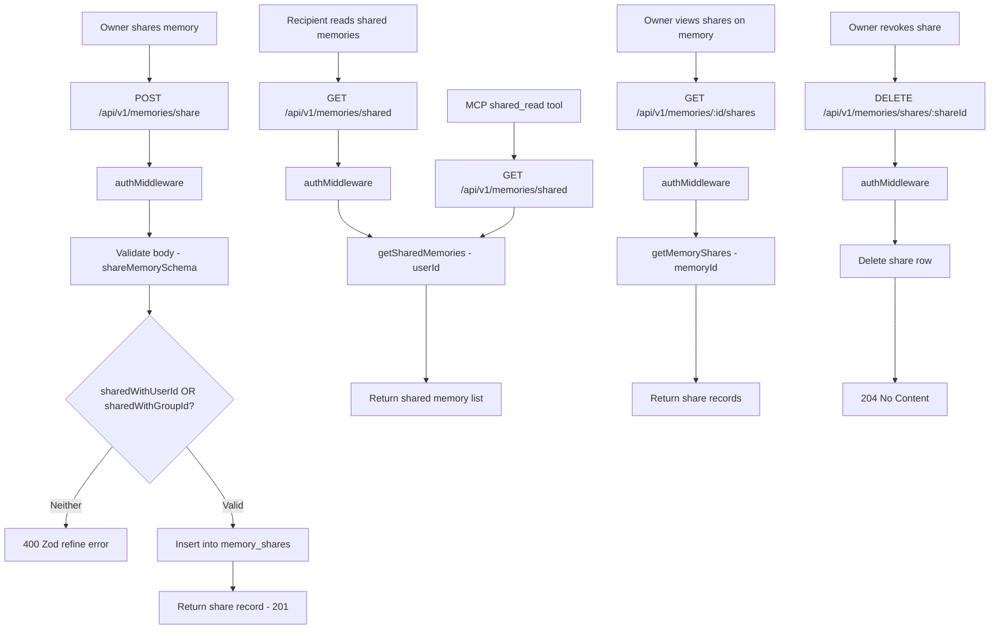

# Memory Sharing — Design

## Architecture



## Component Responsibilities

| Component | File | Responsibility |
|---|---|---|
| Route handler | `packages/api/src/routes/memories.ts` | Sharing endpoint registration, auth, audit hooks |
| Sharing service | `packages/api/src/services/sharing.service.ts` | Share insert, delete, query by memory |
| Memory service | `packages/api/src/services/memory.service.ts` | `getSharedMemories(userId)` query |
| Shared schema | `packages/shared/src/validation.ts` | `shareMemorySchema` with mutual exclusivity refine |
| Constants | `packages/shared/src/constants.ts` | `SHARE_LEVELS: ["read", "write"]` |
| Audit middleware | `packages/api/src/middleware/audit.ts` | `onResponse` hooks on share and unshare |
| MCP tool | `packages/mcp-server/src/tools/sharedRead.ts` | `shared_read` — calls `GET /memories/shared` via API client |

## API Contracts

### 1. `POST /api/v1/memories/share` — Share a memory

**Auth**: JWT (any authenticated user)
**Audit**: `onResponse` hook logs `share` on `memory`

**Request body** (validated by `shareMemorySchema`):

```json
{
  "memoryId": "uuid",
  "sharedWithUserId": "uuid (optional)",
  "sharedWithGroupId": "uuid (optional)",
  "level": "read | write (default: read)"
}
```

**Zod refine constraint**: At least one of `sharedWithUserId` or `sharedWithGroupId` must be provided. If neither is set, validation fails with `"Must share with either a user or a group"`.

**Response**: `201 Created`

```json
{
  "id": "uuid",
  "memoryId": "uuid",
  "sharedWithUserId": "uuid | null",
  "sharedWithGroupId": "uuid | null",
  "level": "read",
  "createdAt": "ISO-8601"
}
```

**Errors**:

| Status | Condition |
|---|---|
| 400 | Validation failure (missing target, invalid UUID) |
| 401 | Missing or invalid JWT |
| 403 | Non-admin user does not own the memory |
| 404 | Memory not found |
| 500 | FK violation (invalid memoryId, userId, or groupId) |

### 2. `GET /api/v1/memories/shared` — List memories shared with me

**Auth**: JWT (any authenticated user)

**Behavior**: Calls `memoryService.getSharedMemories(request.userId)` which returns all memories where the requesting user has a share record (either directly via `sharedWithUserId` or via group membership through `sharedWithGroupId`).

**Response**: `200 OK` — Array of memory objects.

```json
[
  {
    "id": "uuid",
    "projectId": "uuid",
    "title": "string",
    "content": "string",
    "category": "string",
    "tags": ["string"],
    ...
  }
]
```

### 3. `GET /api/v1/memories/:id/shares` — List shares on a specific memory

**Auth**: JWT (any authenticated user)

**Behavior**: Returns all share records for the given memory ID. No ownership check — any authenticated user can view the share list if they know the memory ID.

**Response**: `200 OK` — Array of share records.

```json
[
  {
    "id": "uuid",
    "memoryId": "uuid",
    "sharedWithUserId": "uuid | null",
    "sharedWithGroupId": "uuid | null",
    "level": "read",
    "createdAt": "ISO-8601"
  }
]
```

### 4. `DELETE /api/v1/memories/shares/:shareId` — Revoke a share

**Auth**: JWT (any authenticated user)
**Audit**: `onResponse` hook logs `unshare` on `memory`

**Behavior**: Deletes the share record by `shareId`. No ownership check — any authenticated user can delete a share if they know the share ID.

**Response**: `204 No Content`

## MCP Integration

The `shared_read` MCP tool (registered in `packages/mcp-server/src/server.ts`) exposes shared memories to agent CLIs.

**Tool**: `shared_read`
**Parameters**: None (empty schema `{}`)
**Behavior**: Calls `GET /api/v1/memories/shared` using the authenticated API client (PAT-based auth resolved on MCP server startup). Returns shared memories as JSON text content.

**Response format**:

```json
{
  "content": [
    {
      "type": "text",
      "text": "[...serialized memories...]"
    }
  ]
}
```

Returns `"No shared memories available."` if the array is empty.

## Data Model

### `memory_shares` table

```
memory_shares
├── id                   uuid PK
├── memory_id            uuid FK → memories.id (CASCADE)
├── shared_with_user_id  uuid FK → users.id (CASCADE) — nullable
├── shared_with_group_id uuid FK → groups.id (CASCADE) — nullable
├── level                text NOT NULL DEFAULT 'read'  — 'read' | 'write'
└── created_at           timestamptz NOT NULL DEFAULT now()
```

**Foreign key cascades**:
- Deleting the source memory cascades to delete all its shares
- Deleting the target user cascades to delete shares targeting that user
- Deleting the target group cascades to delete shares targeting that group

**Mutual exclusivity**: Exactly one of `shared_with_user_id` or `shared_with_group_id` should be non-null. This is enforced at the API validation layer (Zod refine) but not at the database level (no CHECK constraint).

**No unique constraint**: The same memory can be shared with the same user/group multiple times at different levels. Duplicate prevention is the caller's responsibility.

### Related: `memories` table (read-only by sharing service)

The sharing service reads from `memories` via the memory service's `getSharedMemories` function but does not write to the `memories` table.

## Design Decisions & Trade-offs

### Write-level sharing does not grant edit rights in v1

The `level` column supports `"read"` and `"write"` values, but in the current implementation, both levels provide identical read-only access. The `"write"` level exists as a future reservation for when collaborative editing is implemented. This avoids a schema migration later while acknowledging that the current behavior does not differentiate between levels.

### Mutual exclusivity enforced at API layer only

The `shareMemorySchema` Zod refine ensures that at least one target (user or group) is provided, but no database CHECK constraint prevents both from being set simultaneously or both from being null (if the API is bypassed). A CHECK constraint like `CHECK (shared_with_user_id IS NOT NULL OR shared_with_group_id IS NOT NULL)` could be added for defense-in-depth.

### No cascade on group membership change

When a user is removed from a group, shares targeting that group are not automatically cleaned up or re-evaluated. The user simply loses access because `getSharedMemories` resolves group membership at query time. This means the share record still exists but becomes ineffective for the removed user. No explicit cleanup job runs on membership changes.

### No share notifications

Creating a share does not trigger any notification to the recipient (no email, no in-app notification, no webhook). The recipient discovers shared memories by querying `GET /memories/shared` or using the `shared_read` MCP tool. This keeps the implementation simple but means shared memories may go unnoticed.

### Ownership check on share (partial)

The share endpoint (`POST /memories/share`) verifies that non-admin users own the memory before sharing — returns 403 if the requesting user is not the memory owner. Admins can share any memory. The unshare endpoint (`DELETE /memories/shares/:shareId`) does not yet verify ownership — any authenticated user can revoke any share by share ID. Full ownership enforcement on unshare should be added in hardening.

### No duplicate share prevention

The API does not check whether an identical share already exists before inserting. Sharing the same memory with the same user at the same level creates a duplicate row. This simplifies the insert logic but could lead to data clutter over time.

## Non-Functional Requirements

| NFR | Requirement |
|---|---|
| Data integrity | FK cascades ensure no orphaned shares when memories, users, or groups are deleted |
| Auth | All endpoints require JWT authentication |
| Auditability | Share and unshare actions are logged via `onResponse` audit hooks |
| MCP access | Shared memories are accessible to agent CLIs via the `shared_read` tool |
| Extensibility | `level` column supports future write-level differentiation without schema changes |
| Consistency | Group-based sharing resolves membership at query time (no materialized access) |
