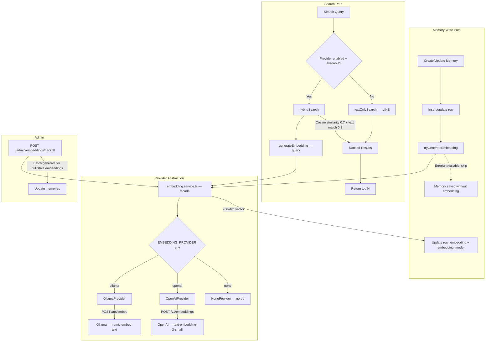

# Semantic Search — Design

## Overview

Semantic search enables finding memories by meaning rather than exact text matches. The architecture combines vector similarity search (pgvector cosine distance on 768-dimensional embeddings) with existing text-based ILIKE search into a hybrid scoring system. The embedding layer is provider-agnostic — selecting between Ollama (self-hosted), OpenAI (cloud), or none (disabled) via the `EMBEDDING_PROVIDER` environment variable.

Embeddings are generated inline on memory create/update with try/catch fallback (best-effort enrichment). The `embedding_model` column tracks which model generated each vector, preventing cross-model similarity comparisons.

## Architecture



## Component Responsibilities

| Component | File | Responsibility |
|---|---|---|
| Provider interface | `packages/api/src/services/embedding/types.ts` | `EmbeddingProviderInterface` with `generateEmbedding`, `isAvailable`, `name`, `model` |
| Ollama provider | `packages/api/src/services/embedding/ollama.provider.ts` | Generates embeddings via Ollama REST API (`/api/embed`) |
| OpenAI provider | `packages/api/src/services/embedding/openai.provider.ts` | Generates embeddings via OpenAI API (`/v1/embeddings`) with `dimensions: 768` |
| None provider | `packages/api/src/services/embedding/none.provider.ts` | No-op provider — `generateEmbedding` throws, `isAvailable` returns true |
| Embedding facade | `packages/api/src/services/embedding.service.ts` | Factory selects provider from `EMBEDDING_PROVIDER` env; re-exports backward-compatible functions |
| Memory service | `packages/api/src/services/memory.service.ts` | Memory CRUD with inline embedding on create/update; hybrid search with vector + text scoring |
| DB schema | `packages/api/src/db/schema.ts` | `memories.embedding` (`vector(768)`) + `memories.embedding_model` (`text`, nullable) |
| Health check | `packages/api/src/routes/health.ts` | Reports `embedding: "ok" | "unavailable" | "disabled"` + `embeddingProvider` name |
| Backfill endpoint | `packages/api/src/routes/admin.ts` | `POST /api/v1/admin/embeddings/backfill` — batch-generates embeddings for null/stale rows |
| Shared constants | `packages/shared/src/constants.ts` | `EMBEDDING_DIMENSION = 768`, `EMBEDDING_PROVIDERS` |
| Shared types | `packages/shared/src/types.ts` | `EmbeddingProvider` type, `Memory.embeddingModel` field |

## Implementation

### Provider Interface

```ts
interface EmbeddingProviderInterface {
  readonly name: string;
  readonly model: string;
  generateEmbedding(text: string): Promise<number[]>;
  isAvailable(): Promise<boolean>;
}
```

### Embedding Generation (Write Path)

When a memory is created or updated, generate an embedding from the concatenation of title and content:

```
Input text = "{title}\n\n{content}"
Embedding = generateEmbedding(input text)  // 768-dim float[]
Store in memories.embedding + memories.embedding_model columns
```

**Graceful degradation**: If the provider is unavailable or `generateEmbedding` throws, the memory is saved without an embedding. Errors are logged. The admin backfill endpoint can fill in missing embeddings later.

### Hybrid Search (Read Path)

The search function combines text matching with vector similarity:

1. **Text component**: ILIKE on title and content (existing behavior).
2. **Vector component**: Cosine similarity between query embedding and stored embeddings using pgvector's `<=>` (cosine distance) operator. Only compares vectors from the same `embedding_model`.
3. **Score blending**: `vector_score * 0.7 + text_match * 0.3`.

```sql
SELECT m.*
FROM memories m
WHERE (
  (m.embedding IS NOT NULL AND m.embedding_model = :currentModel)
  OR m.title ILIKE :pattern
  OR m.content ILIKE :pattern
)
AND m.project_id = :projectId  -- optional filters
ORDER BY (
  CASE WHEN m.embedding IS NOT NULL AND m.embedding_model = :currentModel
    THEN (1.0 - (m.embedding <=> :queryVector::vector))
    ELSE 0
  END * 0.7
  + CASE WHEN m.title ILIKE :pattern OR m.content ILIKE :pattern
    THEN 1 ELSE 0
  END * 0.3
) DESC
LIMIT :limit;
```

**Fallback**: If the embedding provider is unavailable at search time, falls back to text-only ILIKE search.

### API Contract

The search endpoint contract does not change:

| Method | Path | Auth | Input | Output |
|---|---|---|---|---|
| POST | `/api/v1/memories/search` | JWT/PAT | `{ query: string, projectId?: uuid, category?: string, limit?: number }` | `Array<Memory>` (ranked by hybrid score) |

The MCP `memory_search` tool also remains unchanged — it forwards to the same API endpoint.

### Admin Backfill Endpoint

| Method | Path | Auth | Input | Output |
|---|---|---|---|---|
| POST | `/api/v1/admin/embeddings/backfill` | JWT (admin) | `?limit=100` | `{ total, succeeded, failed, model }` |

Finds memories with null embedding or stale `embedding_model`, generates embeddings in batch.

### Environment Variables

| Variable | Default | Description |
|---|---|---|
| `EMBEDDING_PROVIDER` | `ollama` | Provider selection: `ollama`, `openai`, or `none` |
| `OLLAMA_URL` | `http://localhost:11434` | Ollama server URL (when provider is `ollama`) |
| `EMBEDDING_MODEL` | `nomic-embed-text` | Ollama model name (when provider is `ollama`) |
| `OPENAI_API_KEY` | — | OpenAI API key (required when provider is `openai`) |
| `OPENAI_EMBEDDING_MODEL` | `text-embedding-3-small` | OpenAI model (when provider is `openai`) |
| `OPENAI_BASE_URL` | `https://api.openai.com/v1` | OpenAI API base URL (when provider is `openai`) |

## Data Models

### `memories` table (embedding-relevant)

```
memories
├── ...
├── embedding        vector(768) (nullable)
├── embedding_model  text (nullable) — tracks which model generated the vector
├── ...
```

The custom Drizzle type handles serialization:
- **To driver**: `[1.0, 2.0, ...] -> "[1.0,2.0,...]"` (pgvector text format)
- **From driver**: `"[1.0,2.0,...]" -> [1.0, 2.0, ...]` (JavaScript number array)

### pgvector Setup

PostgreSQL must have the `vector` extension enabled:

```sql
CREATE EXTENSION IF NOT EXISTS vector;
```

The `memories` table column is defined as `vector(768)`, storing 768-dimensional float vectors.

### Recommended Index (Future)

For efficient approximate nearest neighbor search at scale:

```sql
CREATE INDEX idx_memories_embedding ON memories
  USING hnsw (embedding vector_cosine_ops);
```

For the expected scale (thesis project, hundreds to low thousands of memories), exact search without an index is likely sufficient.

## Design Decisions and Trade-offs

### 1. Platform-agnostic provider abstraction

**Decision**: Abstract the embedding provider behind an interface with Ollama, OpenAI, and none implementations, selected via `EMBEDDING_PROVIDER` env var.

**Rationale**: Ollama requires ~1GB RAM for self-hosting. OpenAI provides a zero-infrastructure alternative. The `none` provider allows dev/testing without any embedding service. No runtime switching is needed — provider is fixed at startup.

**Trade-off**: Slightly more code than a single hardcoded provider. The `dimensions: 768` parameter on OpenAI API calls truncates from the model's native dimension, which may reduce quality marginally versus native 768-dim models.

### 2. Hybrid search over pure vector search

**Decision**: Combine ILIKE text matching with vector cosine similarity (0.7 vector / 0.3 text weighting).

**Rationale**: Text search catches exact keyword matches that vector search might rank lower (e.g., searching for an exact variable name). Vector search catches semantic matches that text search misses (e.g., "authentication" matching a memory about "login flow").

**Trade-off**: More complex query logic. The weight balance needs tuning based on real usage patterns.

### 3. Graceful degradation when provider is unavailable

**Decision**: Both write and search paths gracefully degrade. Writes skip embedding generation; searches fall back to text-only.

**Rationale**: The embedding provider may not always be available. The system must remain functional.

**Trade-off**: Memories created when provider is down have null embeddings and are invisible to vector search until backfilled.

### 4. `embedding_model` column for model tracking

**Decision**: Store the model name alongside each embedding vector. Hybrid search filters on `embedding_model = currentModel`.

**Rationale**: Prevents comparing vectors from different models (e.g., nomic-embed-text vs text-embedding-3-small), which would produce meaningless similarity scores. Also enables seamless model migration via the backfill endpoint.

**Trade-off**: Extra nullable column. Existing null embeddings are unaffected.

### 5. Embedding on title + content concatenation

**Decision**: Generate a single embedding from `"{title}\n\n{content}"`.

**Rationale**: A single embedding captures the full semantic context. Separate embeddings would require two vector columns and more complex search queries.

### 6. No real-time embedding requirement

**Decision**: Embedding generation is best-effort and inline (try/catch fallback).

**Rationale**: Users should not experience write failures due to embedding service issues. Memory is always saved first.

### 7. Docker Compose profiles for optional Ollama

**Decision**: Ollama service uses `profiles: ["ollama"]` — only starts with `docker compose --profile ollama up`.

**Rationale**: When using `EMBEDDING_PROVIDER=openai` or `none`, Ollama should not consume resources.

## Non-Functional Requirements

- **Availability**: System fully functional when embedding provider is unavailable or disabled. Search degrades to text-only; writes succeed without embeddings.
- **Data integrity**: Both `embedding` and `embedding_model` columns are nullable. All queries handle null embeddings.
- **Performance**: Vector search uses appropriate pgvector indexes at scale. Exact search is acceptable initially.
- **Backward compatibility**: Search API contract unchanged. Callers transparently benefit from improved ranking.
- **Observability**: Health endpoint reports embedding provider status. Embedding failures are logged.
- **Storage**: 768-dimensional vectors add approximately 6KB per memory.
