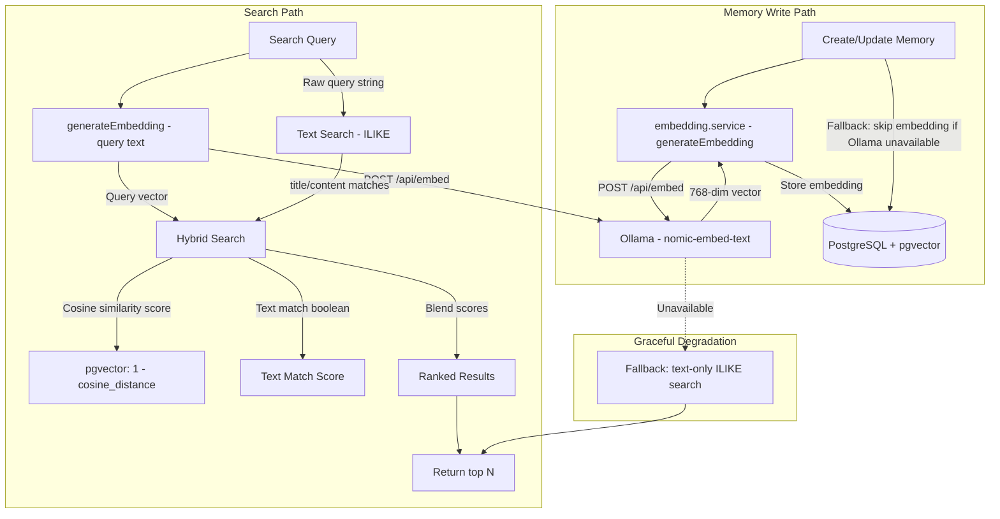

# Semantic Search — Design

## Overview

Semantic search enables finding memories by meaning rather than exact text matches. The target architecture combines vector similarity search (pgvector cosine distance on 768-dimensional embeddings from Ollama's nomic-embed-text model) with the existing text-based ILIKE search into a hybrid scoring system. This is Phase 5 planned work. The embedding infrastructure (pgvector column, embedding service, Ollama health check) exists but embeddings are NOT currently generated during memory create/update. Current search is text-only (ILIKE on title and content).

## Architecture (Target)



## Component Responsibilities

| Component | File | Responsibility |
|---|---|---|
| Embedding service | `packages/api/src/services/embedding.service.ts` | Generates 768-dim embeddings via Ollama REST API, checks Ollama availability |
| Memory service | `packages/api/src/services/memory.service.ts` | Memory CRUD + search (currently text-only ILIKE); target: hybrid search with vector scoring |
| DB schema | `packages/api/src/db/schema.ts` | `memories.embedding` column (`vector(768)` via custom pgvector type) |
| Health check | `packages/api/src/routes/health.ts` | `GET /api/v1/health` includes Ollama availability check |
| Shared constants | `packages/shared/src/constants.ts` | `EMBEDDING_DIMENSION = 768` |

## Current Implementation State

### What Exists

1. **pgvector column**: The `memories` table has an `embedding` column of type `vector(768)` defined in the Drizzle schema with a custom type that handles serialization (`number[] <-> "[1,2,3,...]"` string).

2. **Embedding service** (`embedding.service.ts`):
   - `generateEmbedding(text)`: POSTs to `{OLLAMA_URL}/api/embed` with model `nomic-embed-text`, returns `number[]` (first embedding from response).
   - `isOllamaAvailable()`: GETs `{OLLAMA_URL}/api/tags` with a 2-second timeout, returns boolean.

3. **Text-only search** (`memory.service.ts` `searchMemories`):
   - Uses `ILIKE` on `memories.title` and `memories.content` with `%query%` pattern.
   - Filters by `projectId`, `userId`, `category`.
   - Orders by `updatedAt DESC`.
   - Returns up to `limit` results (default 20).

### What Does NOT Exist Yet

1. **Embedding generation on write**: `createMemory` and `updateMemory` do not call `generateEmbedding`. The `embedding` column remains null for all memories.

2. **Vector search in queries**: `searchMemories` does not use pgvector operators. No cosine similarity calculation.

3. **Hybrid score blending**: No scoring function combining text and vector relevance.

4. **Backfill mechanism**: No migration or job to generate embeddings for existing memories.

## Target Design

### Embedding Generation (Write Path)

When a memory is created or updated, generate an embedding from the concatenation of title and content:

```
Input text = "{title}\n\n{content}"
Embedding = generateEmbedding(input text)  // 768-dim float[]
Store in memories.embedding column
```

**Graceful degradation**: If Ollama is unavailable (`isOllamaAvailable()` returns false or `generateEmbedding` throws), the memory is saved without an embedding. The `embedding` column remains null. A background job or manual trigger can backfill later.

### Hybrid Search (Read Path)

The target search function combines text matching with vector similarity:

1. **Text component**: ILIKE on title and content (existing behavior).
2. **Vector component**: Cosine similarity between query embedding and stored embeddings using pgvector's `<=>` (cosine distance) operator. Similarity = `1 - cosine_distance`.
3. **Score blending**: Weighted combination of text match and vector similarity.

```sql
-- Conceptual query (target implementation)
SELECT *,
  (1 - (embedding <=> query_vector)) AS vector_score,
  CASE WHEN title ILIKE '%query%' OR content ILIKE '%query%' THEN 1 ELSE 0 END AS text_match
FROM memories
WHERE project_id = :projectId
  AND (
    embedding IS NOT NULL  -- has vector
    OR title ILIKE '%query%'
    OR content ILIKE '%query%'
  )
ORDER BY
  (COALESCE(1 - (embedding <=> query_vector), 0) * 0.7 + text_match * 0.3) DESC
LIMIT :limit;
```

**Fallback**: If Ollama is unavailable at search time (cannot embed the query), fall back to the current text-only ILIKE search. This preserves functionality when the embedding service is down.

### API Contract

The search endpoint contract does not change:

| Method | Path | Auth | Input | Output |
|---|---|---|---|---|
| POST | `/api/v1/memories/search` | JWT/PAT | `{ query: string, projectId?: uuid, category?: string, limit?: number }` | `Array<Memory>` (ranked by hybrid score) |

The MCP `memory_search` tool also remains unchanged — it forwards to the same API endpoint.

### Embedding Service API Contract

| Direction | URL | Method | Body | Response |
|---|---|---|---|---|
| Generate embedding | `{OLLAMA_URL}/api/embed` | POST | `{ model: "nomic-embed-text", input: string }` | `{ embeddings: number[][] }` (first element used) |
| Health check | `{OLLAMA_URL}/api/tags` | GET | — | 200 OK if available |

### Environment Variables

| Variable | Default | Description |
|---|---|---|
| `OLLAMA_URL` | `http://localhost:11434` | Ollama server URL |
| `EMBEDDING_MODEL` | `nomic-embed-text` | Model name for embedding generation |

## Data Models

### `memories` table (embedding-relevant)

```
memories
├── ...
├── embedding    vector(768) (nullable)
├── ...
```

The custom Drizzle type handles serialization:
- **To driver**: `[1.0, 2.0, ...] -> "[1.0,2.0,...]"` (pgvector text format)
- **From driver**: `"[1.0,2.0,...]" -> [1.0, 2.0, ...]` (JavaScript number array)

### pgvector Setup

PostgreSQL must have the `vector` extension enabled:

```sql
CREATE EXTENSION IF NOT EXISTS vector;
```

The `memories` table column is defined as `vector(768)`, storing 768-dimensional float vectors.

### Recommended Index (Future)

For efficient approximate nearest neighbor search at scale:

```sql
CREATE INDEX idx_memories_embedding ON memories
  USING ivfflat (embedding vector_cosine_ops)
  WITH (lists = 100);
```

Or with HNSW for better recall:

```sql
CREATE INDEX idx_memories_embedding ON memories
  USING hnsw (embedding vector_cosine_ops);
```

The choice depends on the dataset size and query performance requirements. For the expected scale (thesis project, hundreds to low thousands of memories), exact search without an index is likely sufficient.

## Design Decisions and Trade-offs

### 1. Hybrid search over pure vector search

**Decision**: Combine ILIKE text matching with vector cosine similarity rather than relying solely on embeddings.

**Rationale**: Text search catches exact keyword matches that vector search might rank lower (e.g., searching for an exact variable name). Vector search catches semantic matches that text search misses (e.g., "authentication" matching a memory about "login flow").

**Trade-off**: More complex query logic and scoring. The weight balance (proposed 0.7 vector / 0.3 text) needs tuning based on real usage patterns.

### 2. Graceful degradation when Ollama is unavailable

**Decision**: Both write and search paths gracefully degrade without Ollama. Writes skip embedding generation; searches fall back to text-only.

**Rationale**: Ollama runs as a separate service (via Docker Compose) and may not always be available, especially in development or during deploys. The system must remain functional.

**Trade-off**: Memories created when Ollama is down have null embeddings and are invisible to vector search until backfilled.

### 3. nomic-embed-text model (768 dimensions)

**Decision**: Use Ollama's `nomic-embed-text` model producing 768-dimensional vectors.

**Rationale**: Open-source, runs locally (no API costs), good performance for code and technical text, moderate dimensionality balances quality and storage.

**Trade-off**: Requires Ollama to be running and the model to be pulled. 768 dimensions per memory adds storage overhead (approximately 6KB per memory for the vector alone).

### 4. Embedding on title + content concatenation

**Decision**: Generate a single embedding from `"{title}\n\n{content}"` rather than separate embeddings for title and content.

**Rationale**: A single embedding captures the full semantic context. Separate embeddings would require two vector columns and more complex search queries.

**Trade-off**: Very long content may be truncated by the model's context window (nomic-embed-text supports 8192 tokens, which is sufficient for most memories).

### 5. No real-time embedding requirement

**Decision**: Embedding generation is best-effort and non-blocking for the user. If it fails, the memory is saved without an embedding.

**Rationale**: Embedding generation adds latency (Ollama inference). Users should not experience write failures due to embedding service issues.

**Trade-off**: Some memories may not be searchable via vector similarity until a backfill runs.

### 6. Embeddings not yet wired into write path

**Decision**: The existing `createMemory` and `updateMemory` functions do not call `generateEmbedding`. This is deferred to Phase 5.

**Rationale**: Phase 2 (GitHub Integration) and Phase 3 (Testing & Hardening) are prioritized. The embedding infrastructure is in place for when Phase 5 begins.

**Trade-off**: All current memories have null embeddings. A backfill migration will be needed when Phase 5 is implemented.

## Non-Functional Requirements to Preserve

- **Availability**: The system must remain fully functional when Ollama is unavailable. Search degrades to text-only; writes succeed without embeddings.
- **Data integrity**: The `embedding` column is nullable. Existing queries and application logic must handle null embeddings without errors.
- **Performance**: Vector search should use appropriate pgvector indexes at scale. For the expected data volume, exact search is acceptable initially.
- **Backward compatibility**: The search API contract (`POST /api/v1/memories/search`) must not change. Callers should transparently benefit from improved ranking without API modifications.
- **Observability**: The health endpoint (`GET /api/v1/health`) already checks Ollama availability. Embedding generation failures should be logged (not silently swallowed) for monitoring.
- **Storage**: 768-dimensional vectors add approximately 6KB per memory. This is acceptable for the expected scale but should be monitored.
