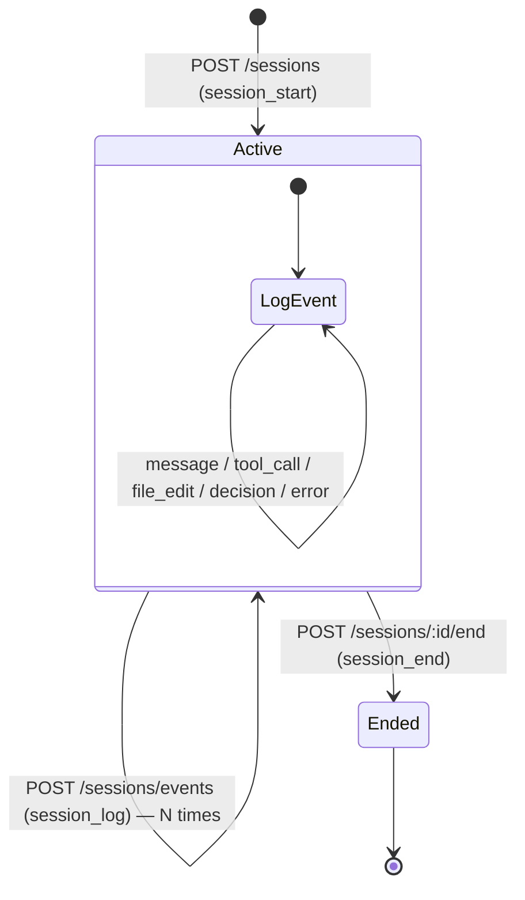
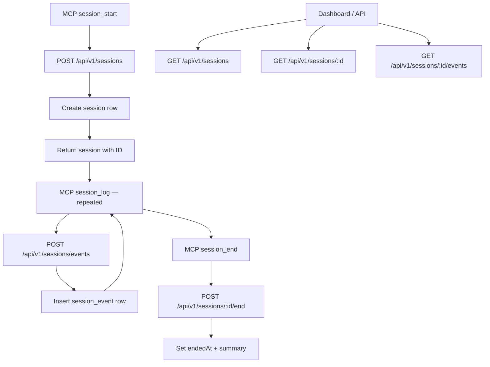

# Session Management — Design

## Architecture





## Component Responsibilities

| Component | File | Responsibility |
|---|---|---|
| Route handler | `packages/api/src/routes/sessions.ts` | Request validation, auth enforcement, audit hooks, delegation to service |
| Session service | `packages/api/src/services/session.service.ts` | Session CRUD, event insertion, list queries with retention filtering |
| Shared schemas | `packages/shared/src/validation.ts` | `createSessionSchema`, `endSessionSchema`, `createSessionEventSchema` |
| Constants | `packages/shared/src/constants.ts` | `AGENT_TYPES`, `SESSION_EVENT_TYPES` |
| Audit middleware | `packages/api/src/middleware/audit.ts` | `onResponse` hooks on create and end routes |
| MCP tools | `packages/mcp-server/src/tools/session*.ts` | `session_start`, `session_log`, `session_end` wrappers |

## API Contracts

### 1. `GET /api/v1/sessions` — List sessions

**Auth**: JWT (any authenticated user)

**Query parameters**:

| Param | Type | Default | Description |
|---|---|---|---|
| `projectId` | uuid (optional) | — | Filter by project |
| `limit` | integer (optional) | 20 | Page size |
| `offset` | integer (optional) | 0 | Page offset |

**Behavior**: Non-admin users are scoped to their own sessions (`userId` filter injected server-side). Admin users see all sessions. Ordered by `startedAt DESC`.

**Response**: `200 OK` — Array of session objects.

```json
[
  {
    "id": "uuid",
    "projectId": "uuid",
    "userId": "uuid",
    "agentType": "claude-code",
    "title": "Refactoring auth module",
    "summary": null,
    "startedAt": "ISO-8601",
    "endedAt": null
  }
]
```

### 2. `GET /api/v1/sessions/:id` — Get session with events

**Auth**: JWT. Non-admin users can only access their own sessions (returns `403` if the session belongs to another user).

**Response**: `200 OK` — Session object with nested `events` array. Events are filtered by `archivedAt IS NULL` and ordered by `createdAt ASC`.

```json
{
  "id": "uuid",
  "projectId": "uuid",
  "userId": "uuid",
  "agentType": "claude-code",
  "title": "string",
  "summary": "string | null",
  "startedAt": "ISO-8601",
  "endedAt": "ISO-8601 | null",
  "events": [
    {
      "id": "uuid",
      "sessionId": "uuid",
      "eventType": "message",
      "content": "string",
      "metadata": {},
      "createdAt": "ISO-8601",
      "archivedAt": null
    }
  ]
}
```

**Errors**: `403` if non-admin user tries to access another user's session. `404` if session not found.

### 3. `POST /api/v1/sessions` — Create session

**Auth**: JWT
**Audit**: `onResponse` hook logs `create` on `session`

**Request body** (validated by `createSessionSchema`):

```json
{
  "projectId": "uuid",
  "agentType": "claude-code | gemini-cli | cursor | kilo-code | opencode | generic",
  "title": "optional string, max 500 chars"
}
```

**Behavior**: `userId` is injected from the JWT, not from the request body.

**Response**: `201 Created` — Full session object with generated `id` and `startedAt`.

### 4. `POST /api/v1/sessions/:id/end` — End session

**Auth**: JWT
**Audit**: `onResponse` hook logs `end` on `session`

**Request body** (validated by `endSessionSchema`):

```json
{
  "summary": "optional string, max 5000 chars"
}
```

**Behavior**: Sets `endedAt` to `new Date()` and stores `summary` if provided. Returns the updated session row.

**Response**: `200 OK` — Updated session object.

### 5. `GET /api/v1/sessions/:id/events` — List session events

**Auth**: JWT. Non-admin users can only access events for their own sessions (returns `403` if the session belongs to another user).

**Behavior**: Returns all non-archived events for the given session, ordered by `createdAt ASC`. Uses `archivedAt IS NULL` filter for retention compliance.

**Response**: `200 OK` — Array of event objects.

### 6. `POST /api/v1/sessions/events` — Log session event

**Auth**: JWT

**Request body** (validated by `createSessionEventSchema`):

```json
{
  "sessionId": "uuid",
  "eventType": "message | tool_call | file_edit | decision | error",
  "content": "string",
  "metadata": { "optional": "record<string, unknown>" }
}
```

**Response**: `201 Created` — Full event object.

## Event Types

| Event Type | Purpose | Typical `content` | Typical `metadata` |
|---|---|---|---|
| `message` | User or agent message | Message text | `{ "role": "user" }` or `{ "role": "assistant" }` |
| `tool_call` | Tool invocation by agent | Tool name and description | `{ "tool": "read_file", "args": {...} }` |
| `file_edit` | File creation or modification | File path and summary | `{ "path": "src/foo.ts", "lines_changed": 12 }` |
| `decision` | Architectural or implementation decision | Decision description | `{ "alternatives": [...], "rationale": "..." }` |
| `error` | Error encountered during session | Error message | `{ "code": "ENOENT", "stack": "..." }` |

The `metadata` column is `jsonb` with no enforced schema — it is a flexible extension point per event type.

## Data Models

### `sessions` table

```
sessions
├── id           uuid PK
├── project_id   uuid FK → projects.id (CASCADE)
├── user_id      uuid FK → users.id (CASCADE)
├── agent_type   text NOT NULL
├── title        text
├── summary      text
├── started_at   timestamptz NOT NULL DEFAULT now()
└── ended_at     timestamptz
```

Indexes: `idx_sessions_project` on `project_id`, `idx_sessions_user` on `user_id`.

### `session_events` table

```
session_events
├── id           uuid PK
├── session_id   uuid FK → sessions.id (CASCADE)
├── event_type   text NOT NULL
├── content      text NOT NULL
├── metadata     jsonb
├── created_at   timestamptz NOT NULL DEFAULT now()
└── archived_at  timestamptz
```

Indexes: `idx_session_events_session` on `session_id`, `idx_session_events_archived` partial index on `archived_at` WHERE `archived_at IS NULL`.

### Retention integration

The `archived_at` column on `session_events` is set by the retention cleanup scheduler. All read queries in the session service filter with `isNull(sessionEvents.archivedAt)` to exclude archived rows. The `sessions` table itself has no `archived_at` column — only events are subject to retention.

## Design Decisions & Trade-offs

### No auto-close for abandoned sessions

Sessions that are started but never ended (e.g., agent crashes, user disconnects) remain in an open state indefinitely. There is no background job or TTL-based auto-close. This was chosen to avoid prematurely closing sessions that may simply be long-running. The dashboard can surface "stale" sessions for manual review.

### No concurrent session limit

A user can have multiple active sessions simultaneously (e.g., running Claude Code and Cursor on the same project). There is no enforcement of session uniqueness per user, project, or agent type. This allows realistic multi-agent workflows without artificial constraints.

### No session reopen after end

Once `endedAt` is set, the session is permanently ended. There is no API to reopen or resume a session. If work continues, a new session must be created. This simplifies the lifecycle model to a single directional state machine: Active -> Ended.

### Events posted to a separate endpoint (not nested under session)

`POST /api/v1/sessions/events` is a top-level route (not `/sessions/:id/events`) because the `sessionId` is in the request body. This simplifies the MCP client — it does not need to interpolate the session ID into the URL path. The trade-off is that the route does not validate session existence before inserting the event; a foreign key constraint in the database handles this.

### Admin sees all sessions

The `GET /api/v1/sessions` endpoint strips the `userId` filter for admin users, giving admins visibility into all student sessions. Non-admin users only see their own sessions. This supports the supervisor oversight use case.

### Audit logging on create and end only

Only the `create` and `end` session actions have audit log hooks. Individual event logging (`POST /sessions/events`) is not audited because events fire at high frequency (potentially hundreds per session) and would create excessive audit noise. The events themselves serve as a detailed log.

## Non-Functional Requirements

| NFR | Requirement |
|---|---|
| Pagination | `limit` (default 20) and `offset` (default 0) on list endpoints |
| Ordering | Sessions: `startedAt DESC`; Events: `createdAt ASC` |
| Retention | Events filtered by `archivedAt IS NULL`; retention policy applied by scheduler |
| Cascade | Deleting a project cascades to sessions; deleting a session cascades to events |
| Data integrity | `session_id` FK constraint prevents orphaned events |
| Auth scoping | Non-admin users see only their own sessions |
| Auditability | Session create/end are audit-logged via `onResponse` hook |
