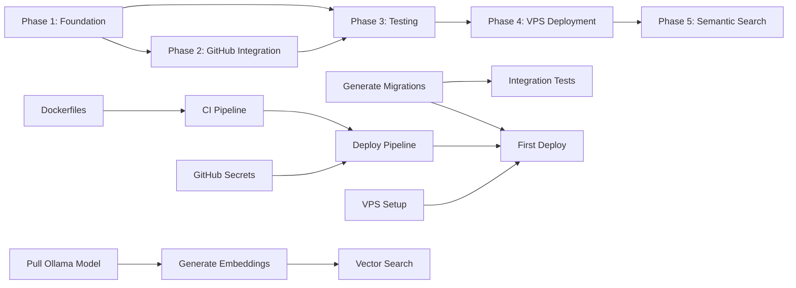

# Project Planning & Task Breakdown

## Milestones

- [x] **Milestone 1: Foundation** — Core packages, DB schema, API routes, MCP server, dashboard scaffold
- [x] **Milestone 2: GitHub Integration** — Connected repos, webhook processing, memory file sync, push-to-repo
- [ ] **Milestone 3: Testing & Hardening** — Unit tests, integration tests, error handling improvements, input validation edge cases
- [ ] **Milestone 4: VPS Deployment** — Docker images, CI/CD pipeline, first production deploy, SSL/domain setup
- [ ] **Milestone 5: Semantic Search** — Ollama embedding generation on memory write, vector similarity search, search quality tuning

## Task Breakdown

### Phase 1: Foundation (Complete)
- [x] Task 1.1: Initialize monorepo (pnpm workspaces, Turborepo, TypeScript config)
- [x] Task 1.2: Create `packages/shared` with constants, Zod schemas, types
- [x] Task 1.3: Create `packages/api` with Fastify, Drizzle ORM, 13-table schema
- [x] Task 1.4: Implement auth system (GitHub/Google OAuth, JWT, PAT generation/hashing)
- [x] Task 1.5: Implement all API routes (health, auth, users, groups, projects, memories, sessions, export, admin)
- [x] Task 1.6: Implement middleware (auth, RBAC, audit logging)
- [x] Task 1.7: Create `packages/mcp-server` with 9 MCP tools
- [x] Task 1.8: Create `packages/dashboard` with React + Vite + Tailwind, 8+ pages
- [x] Task 1.9: Create docker-compose.dev.yml for local Postgres + Ollama

### Phase 2: GitHub Integration (Complete)
- [x] Task 2.1: Implement GitHub OAuth token encryption (AES-256-GCM)
- [x] Task 2.2: Build repo connection flow (list available repos, connect, create webhook)
- [x] Task 2.3: Implement webhook handler (HMAC-SHA256 verification, push event processing)
- [x] Task 2.4: Build memory file scanner (detect CLAUDE.md, GEMINI.md, .cursorrules, etc.)
- [x] Task 2.5: Implement push-to-repo (write memory content to GitHub file)
- [x] Task 2.6: Build repo sync (manual re-scan for memory files)

### Phase 3: Testing & Hardening (Next)
- [ ] Task 3.1: Generate Drizzle database migrations (`pnpm db:generate`)
- [ ] Task 3.2: Write unit tests for Zod validation schemas (shared package)
- [ ] Task 3.3: Write unit tests for PAT hash/verify and token encrypt/decrypt
- [ ] Task 3.4: Write unit tests for export formatters (all 6 formats)
- [ ] Task 3.5: Write integration tests for memory CRUD cycle (with real Postgres + pgvector)
- [ ] Task 3.6: Write integration tests for session lifecycle (create, log events, end)
- [ ] Task 3.7: Write integration tests for auth flow (mock OAuth, JWT, PAT)
- [ ] Task 3.8: Write integration tests for webhook signature verification
- [ ] Task 3.9: Write integration tests for repo sync flow
- [ ] Task 3.10: Write MCP tool round-trip tests (write -> search -> read -> delete)
- [ ] Task 3.11: Add error handling for Ollama unavailability (graceful degradation)
- [ ] Task 3.12: Review and harden all Zod schemas for edge cases

### Phase 4: VPS Deployment
- [ ] Task 4.1: Write Dockerfiles for API and Dashboard packages
- [ ] Task 4.2: Configure GitHub Actions CI (build, test with pgvector service, push to GHCR)
- [ ] Task 4.3: Configure GitHub Actions deploy (SSH to VPS, pull images, run migrations)
- [ ] Task 4.4: Set up Digital Ocean VPS (Docker, nginx reverse proxy, SSL via Let's Encrypt)
- [ ] Task 4.5: Configure GitHub secrets (12 secrets: VPS_HOST, DB_PASSWORD, JWT_SECRET, etc.)
- [ ] Task 4.6: First production deployment and smoke test
- [ ] Task 4.7: Set up domain + SSL certificate
- [ ] Task 4.8: Configure GitHub OAuth callback URLs for production domain

### Phase 5: Semantic Search
- [ ] Task 5.1: Pull `nomic-embed-text` model on Ollama during deploy
- [ ] Task 5.2: Generate embeddings on memory create/update (call Ollama `/api/embed`)
- [ ] Task 5.3: Implement vector similarity search in memory search endpoint
- [ ] Task 5.4: Add hybrid search (text + vector with score blending)
- [ ] Task 5.5: Benchmark vector search latency at 1K, 10K, 100K memories
- [ ] Task 5.6: Tune similarity threshold and result ranking

## Dependencies

### Key Dependencies
- **Migrations before anything**: DB migrations must be generated and tested before integration tests or deployment
- **Postgres before tests**: Integration tests require a real PostgreSQL instance with pgvector
- **Dockerfiles before CI**: Can't push images without Dockerfiles
- **CI before deploy**: Deploy pipeline pulls images built by CI
- **VPS + secrets before first deploy**: Infrastructure must exist before deploying
- **Ollama before semantic search**: Embedding model must be available to generate vectors

### External Dependencies
- **GitHub OAuth App**: Must be configured with correct callback URLs per environment
- **Google OAuth credentials**: Same as above
- **Digital Ocean VPS**: Must be provisioned with Docker installed
- **Domain name**: Required for production SSL and OAuth callbacks
- **GHCR access**: GitHub Container Registry for Docker image storage

## Timeline & Estimates

| Phase | Status | Estimated Effort |
|---|---|---|
| Phase 1: Foundation | Complete | - |
| Phase 2: GitHub Integration | Complete | - |
| Phase 3: Testing & Hardening | Next | Medium |
| Phase 4: VPS Deployment | Pending | Medium |
| Phase 5: Semantic Search | Pending | Medium |

## Risks & Mitigation

| Risk | Likelihood | Impact | Mitigation |
|---|---|---|---|
| **Ollama RAM on small VPS** | Medium | High | Make embeddings optional; fall back to text-only search if Ollama is unavailable. Consider a smaller embedding model. |
| **OAuth token refresh** | Medium | Medium | Detect 401 from GitHub API, prompt user to re-authenticate via dashboard. Store token refresh timestamps. |
| **Webhook delivery reliability** | Low | Medium | Idempotent processing (SHA-based dedup). Manual re-sync endpoint as fallback. Log failed webhook processing. |
| **pgvector performance at scale** | Low | Medium | Add HNSW index on embedding column. Benchmark at 100K memories. Consider partitioning by project if needed. |
| **Single VPS failure** | Low | High | Daily automated Postgres backups. Document restore procedure. Consider managed DB if budget allows. |
| **MCP protocol changes** | Low | Low | Pin `@modelcontextprotocol/sdk` version. Monitor for breaking changes in SDK releases. |

## Resources Needed

### Infrastructure
- 1x Digital Ocean VPS (4GB+ RAM recommended)
- Domain name with DNS management
- GitHub Container Registry (free with GitHub account)

### Services
- GitHub OAuth App (free)
- Google OAuth credentials (free)
- Let's Encrypt SSL (free)

### Tools
- pnpm 9, Node.js 22, TypeScript 5.7
- Docker + Docker Compose
- Turborepo
- Drizzle Kit (migration generation)
